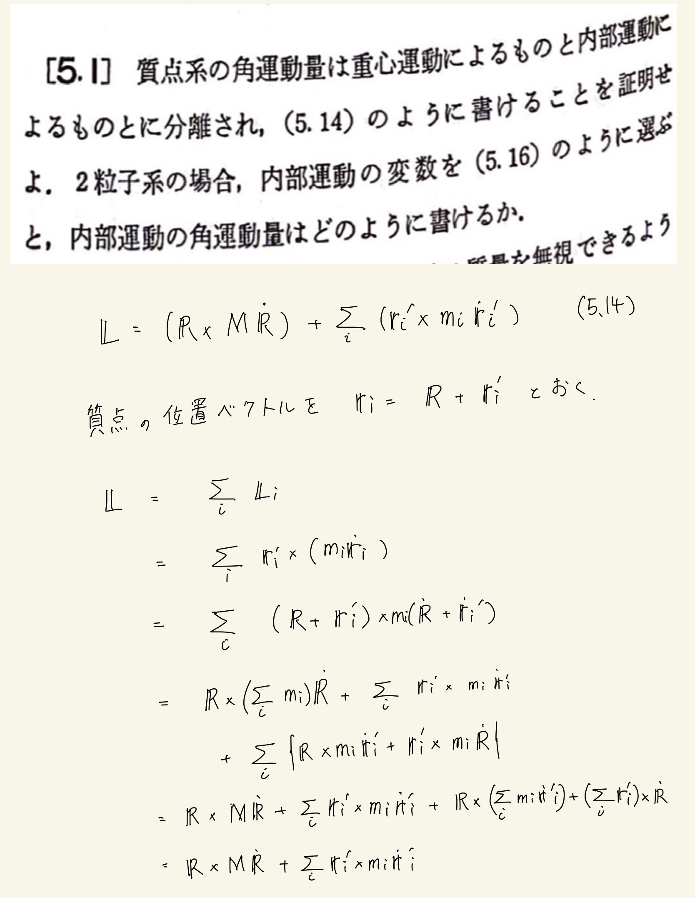
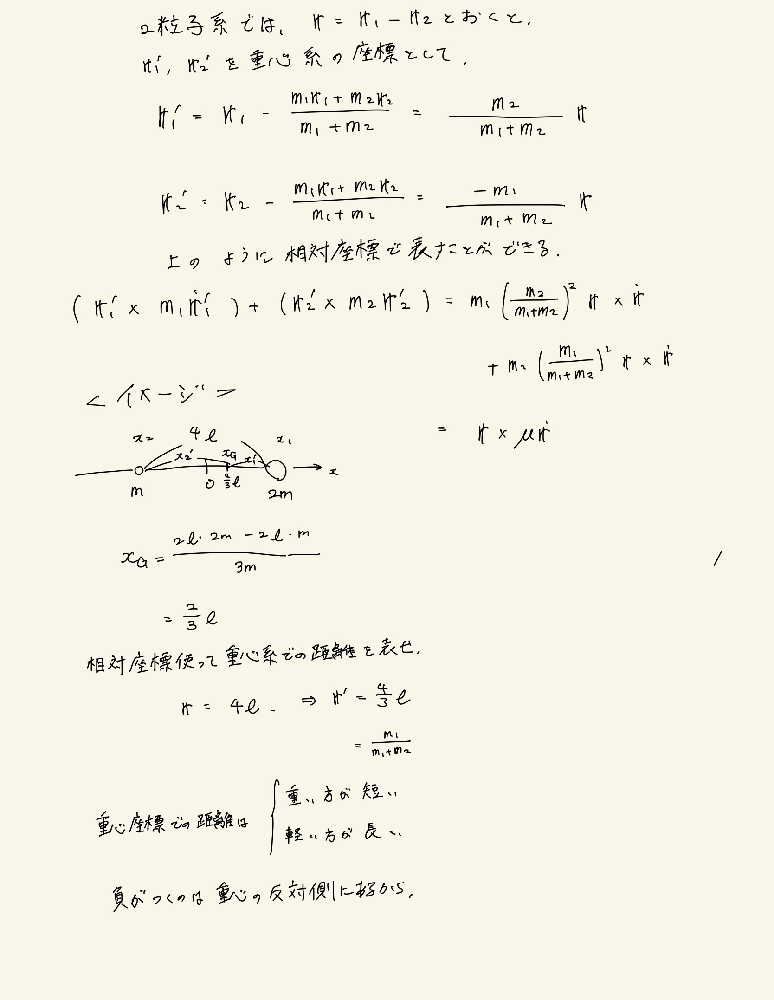

# 質点系の力学
## 5.1 質点系の角運動量 

重心系での(質量)x(座標)や運動量の和はゼロってことを使う。
 

 

慣性質量のお気持ちがわからん。
 
例えば、粒子2が拘束されてて$ \bm{r}_2 = 0, \bm{ \dot r} _2 = 0 $だった場合に
$$ \sum_{i} \bm{r}_i' \times m_i \bm{ \dot r}_i ' = m_1 ( \frac{ m_2 }{ m_1 + m_2 } )^2 \bm{r}_1 \times \bm{ \dot r } _1+ m_2 ( \frac{ m_1 }{ m_1 + m_2 } )^2 \bm{r}_1 \times \bm{ \dot r }_1 $$
$$ = \frac{ m_1 m_2 }{ m_1 + m_2 } \bm{r}_1 \times \bm { \dot r}_1 = \mu ( \bm{r}_1 \times \bm{ \dot r }_1 ) $$
動いてない粒子2の質量が全体の角運動量に出てくるの気色悪い。。

 