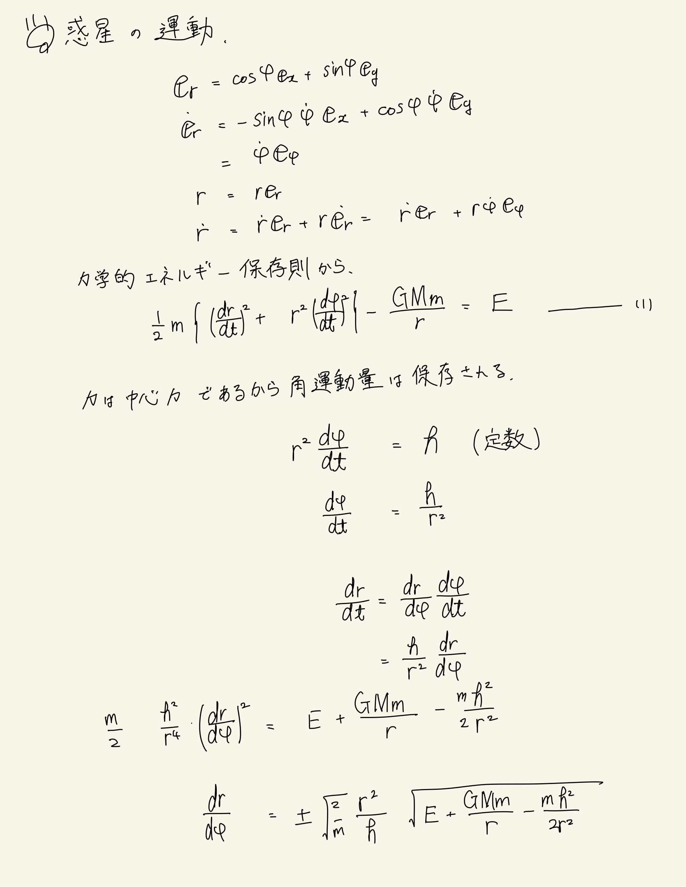
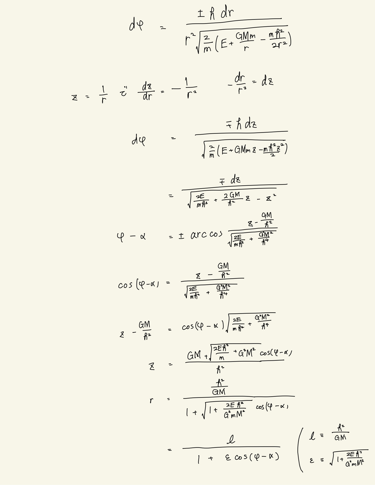
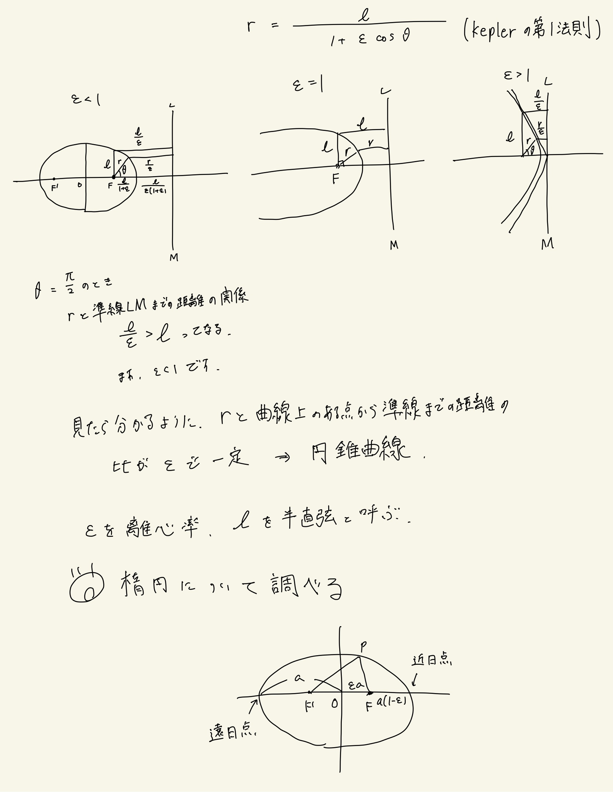
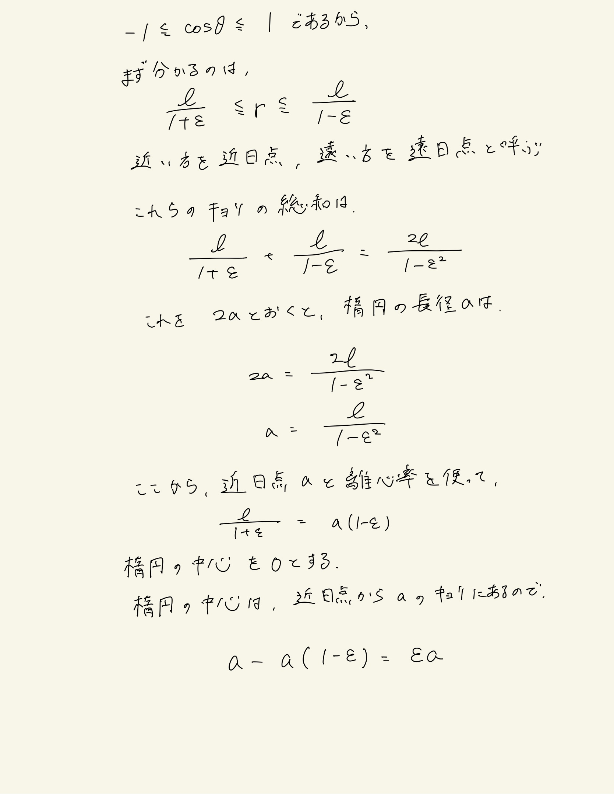
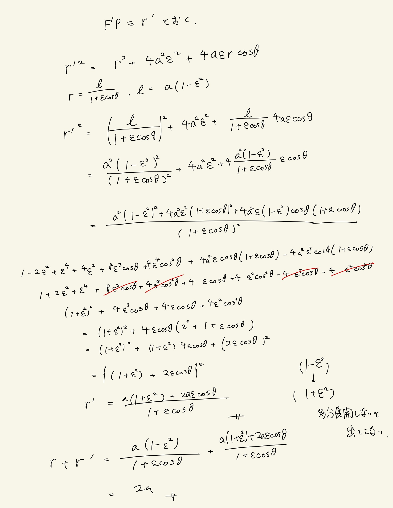
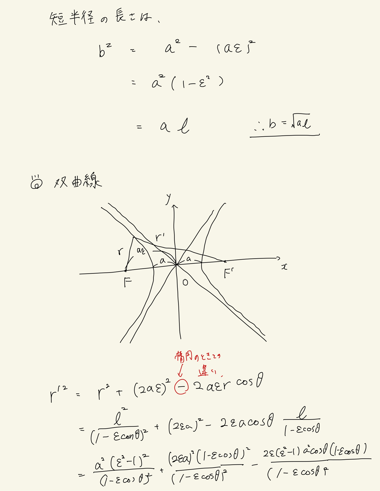
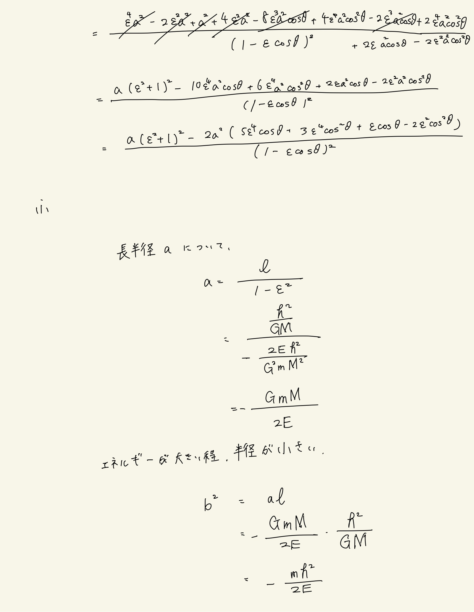
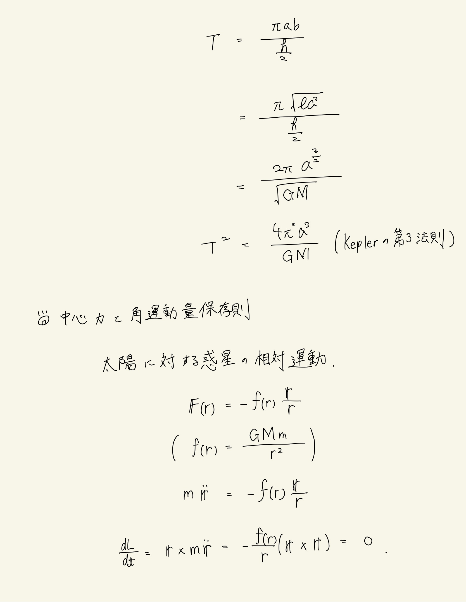
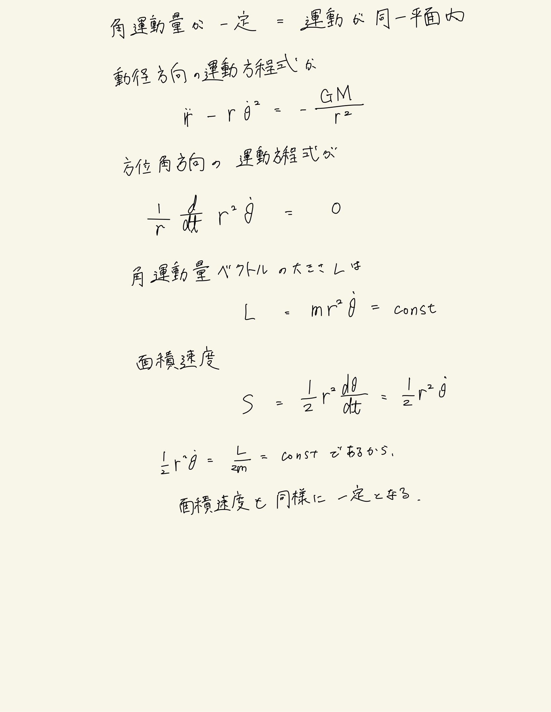

# 質点系の力学
## Keplerの法則

力が中心力$\leftrightarrows$運動は同一平面内
 
動径方向の運動方程式と角運動量保存則を使って、両式から$t$を消去する方針。
 
積分形は逆余弦関数の形をしているので、$\varphi$は$\cos$内に収まり、円錐曲線の方程式が出てくる。あとは離心率によって場合分けすると惑星ないし天体の軌道を求めることができる。
 
楕円の面積速度と長半径、短半径の関係式から周期を求めることができる。

