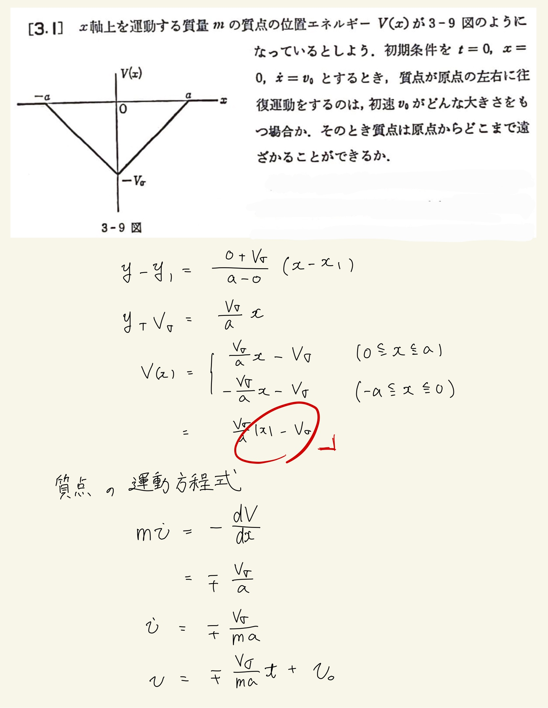
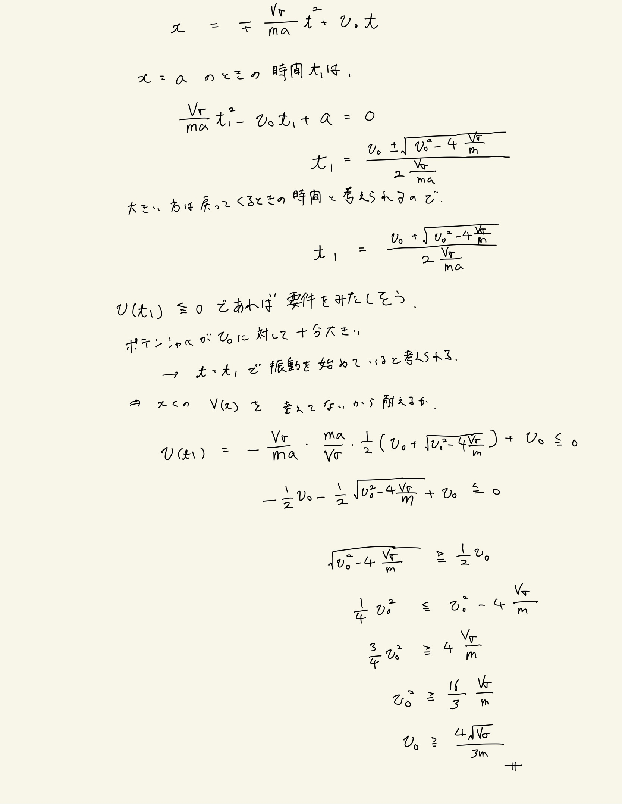
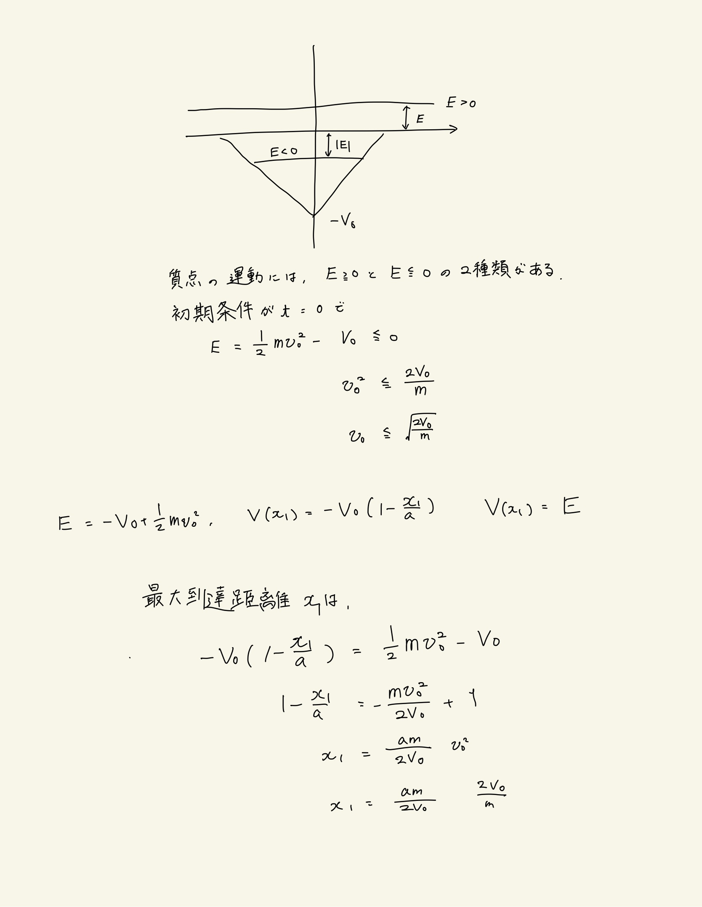
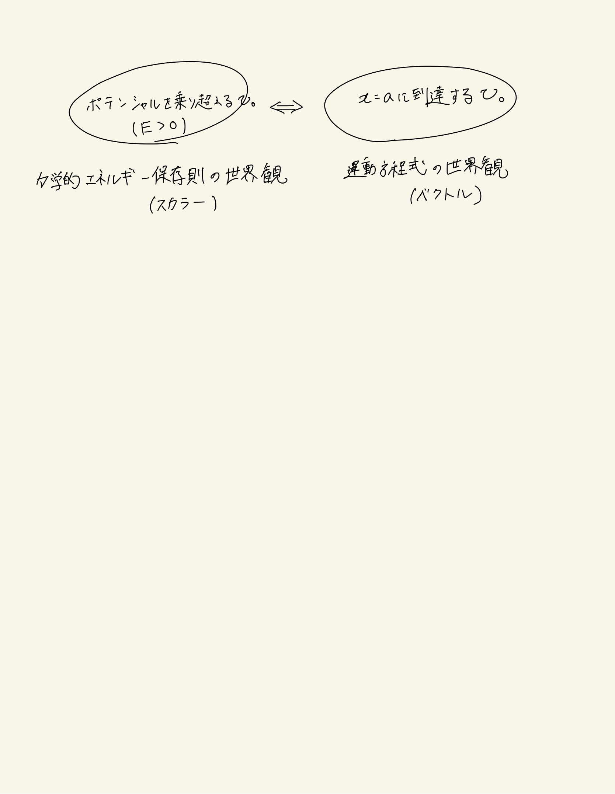

# 質点の力学的エネルギー
## 3.1 ポテンシャルと最大到達距離

自分の解答は以下のとおり。
 
運動方程式を立てて解こうとすると、ポテンシャルが$a$で0になってしまうがために、$v$が0になる際の座標はどこにあるのかを検討しないといけなくなってしまう。そのため、$x$まで積分して$a$に至る時間を求めた。この時点で、$a$に至らない$v_0$を考えると破綻してしまう。つまり、堂々巡りになってしまっていてうまく解が求まらなかったものと考えられる。
 

 
解説を見た際にaが条件に出てこないことに違和感を覚えた。
そうではなく、$v$の大きさが0になる条件を考えると良い。
運動方程式では$v$が0になる条件の見通しが立てられない(たぶん)。
「力学的エネルギー保存則」という強力な法則を使って初めてこの問題は解けるっぽい。
 
問題を解くに際して言えば、力学的エネルギーの世界観と運動方程式の世界観の2種類を行き来しながら解くというイメージを持つと最初の一手が打ちやすそう。
 
