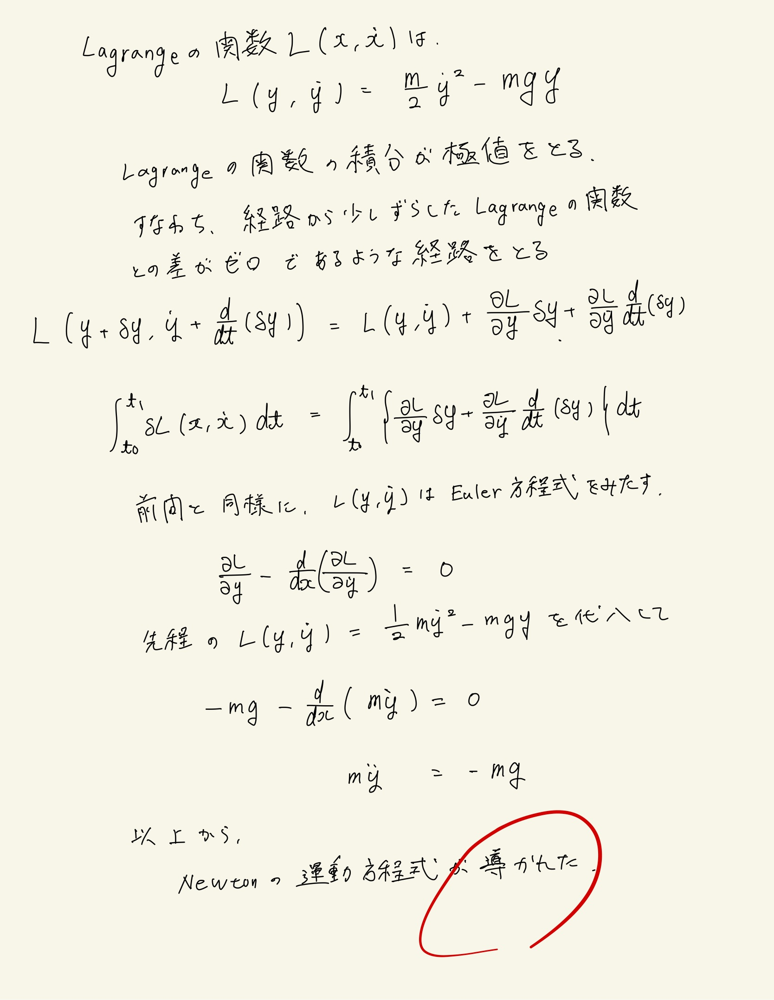

# 質点の力学的エネルギー
## 3.4 Lagrangeの関数とEuler-Lagrange方程式
 
Euler-Lagrange方程式を解いて運動方程式を出す。ポテンシャルの形は決まってないので簡単に解ける。自分は間違えて重力場中のポテンシャルで解いてしまったが。
 

 
全問が座標積分だったのに対して時間積分になっている。Lagrange関数の時間積分が物理的にどういう意味を持つのか。作用って定義されてたと思うけど、作用の物理的イメージが自分にはまだない。受験終わったら解析力学をやるker。