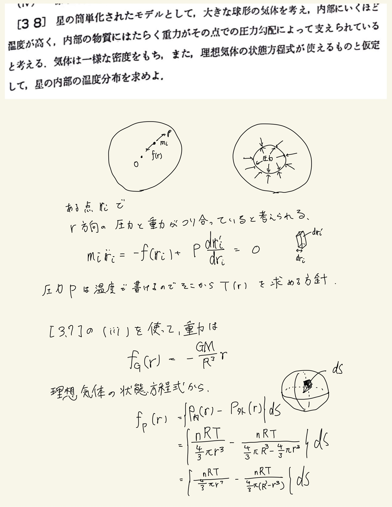
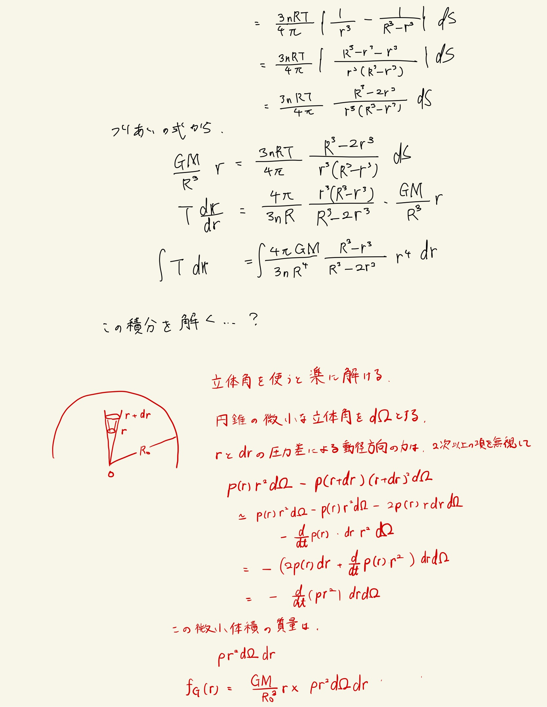
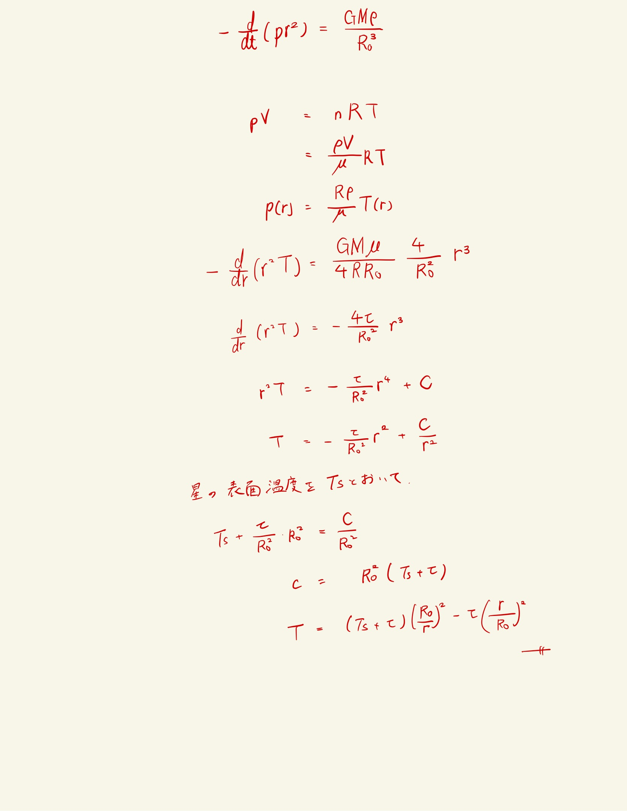

# 質点の力学的エネルギー保存則
## 3.8 星の内部温度分布

力の釣り合いの式を立てるまでは良かったが、
- 立体角を使って微小体積について見る
- rとdrの圧力差が外向きの力

という発想が出てこなかった。  
 
$R$と$R_0$を混合してるのほんまにクソ
 
$\rho(r+dr)(r+dr)^2$のTaylor展開が少し戸惑った。普通にやって二次以上の項を無視すれば良い。
 

