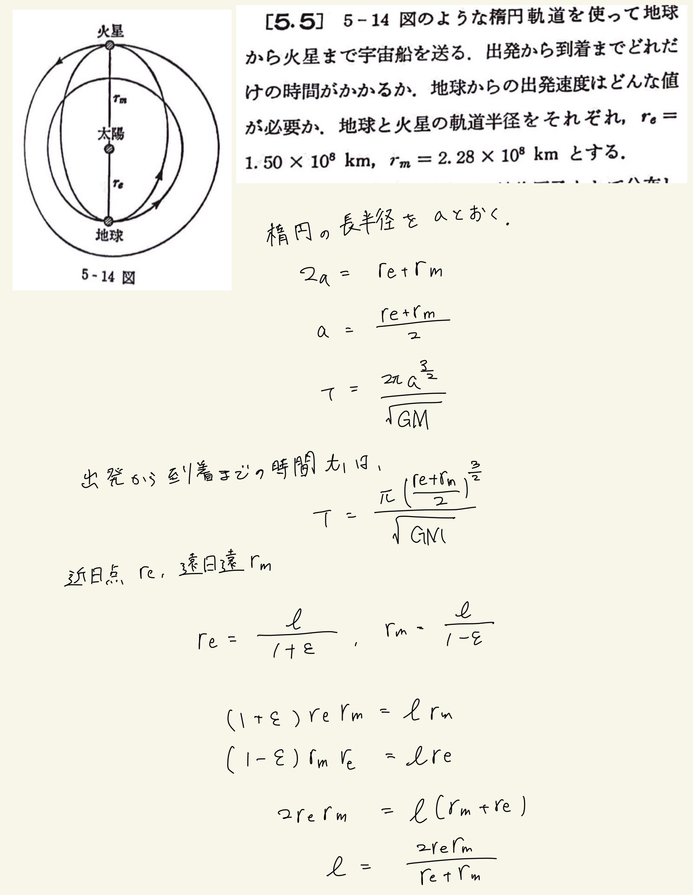
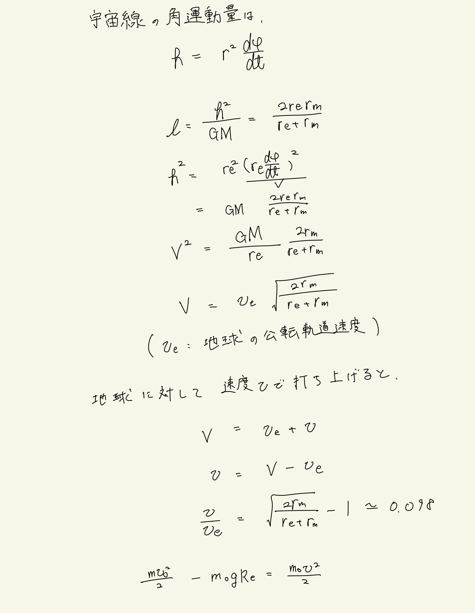
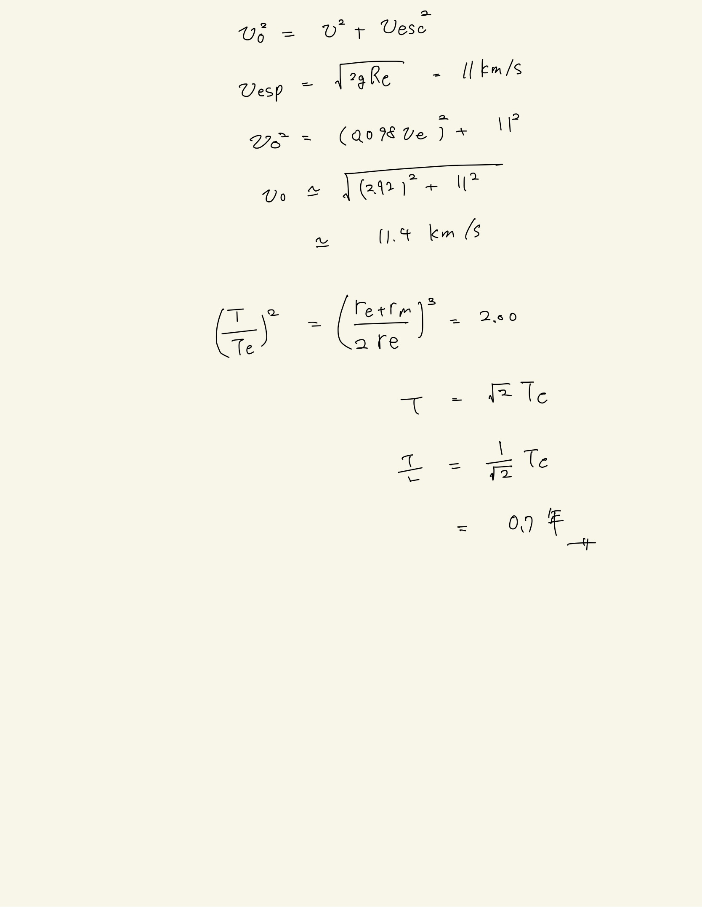

# 質点系の力学
## 5.5 地球から火星に宇宙船を送る

宇宙船自体も太陽の重力場によって楕円軌道を行うことを用いる。
 
近日点・遠日点から離心率$\varepsilon$を消去して半直弦$l$を求める。
 
半直弦$l$の物理的意味は、保存される角運動量の大きさに対応しているので、軌道長半径と角速度ないし速度を求めることができる。
 
力学的エネルギー保存則から、地球からの速度は重力ポテンシャルを打ち消す分の運動エネルギーすなわち速度を持っていなければならない。その分を加味して火星到達速度は以下のようにして計算される。

地球の質量と長半径を基準にして宇宙船の周期を求めるのがとても賢いと思った。
 