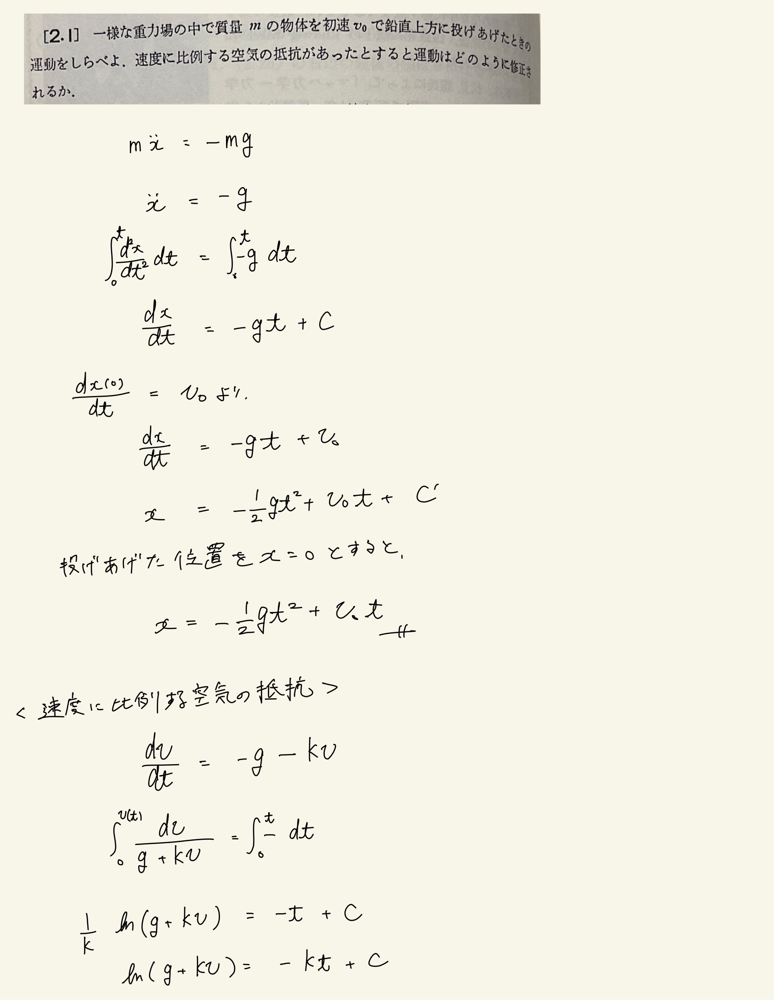
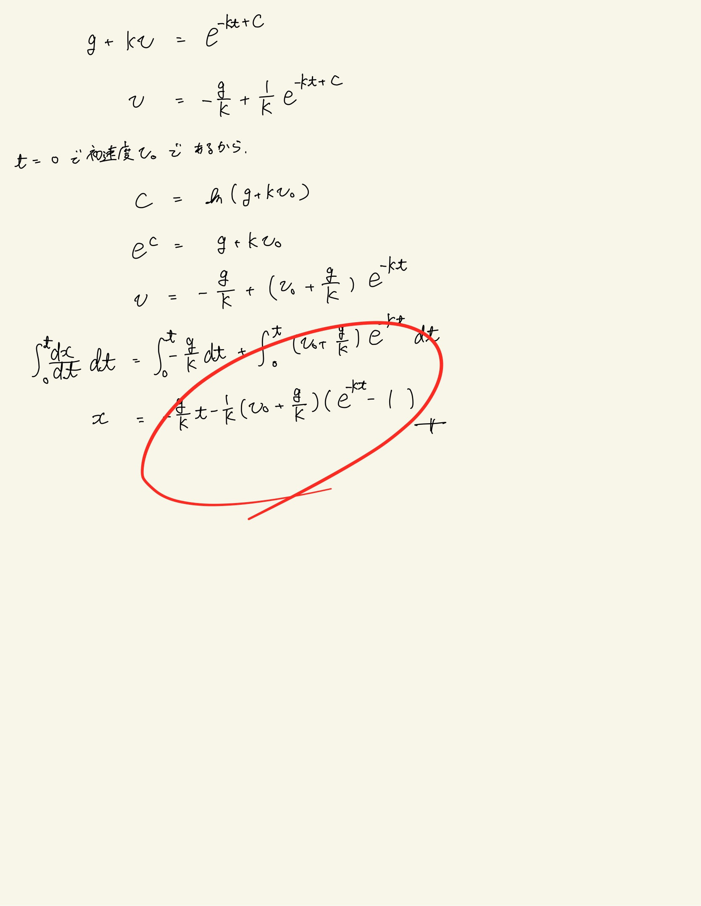

# 質点の運動法則
## 2.1 鉛直投げ上げ運動(抵抗のある場合)

速度に比例する抵抗がある場合、変数分離法で解く。特に問題はない。
速度の二乗に比例する抵抗がある場合面倒なので演習しておくべき。(過去問で出てる)

 

 

$ t \rightarrow \infty $ の極限を取ると

$$ v_{\infty} = - \frac{g}{k} $$

となりこれを"終端速度"と呼ぶ。

 

ちなみに最高到達点に至るまでの時間$t_1$は、$v=0$の条件から

$$ \frac{g}{k} \frac{1}{v_0 + \frac{g}{k}}  = e^{-kt_1} $$

$$ \frac{g}{kv_0 + g}  = e^{-kt_1} $$

$$ \ln {g} - \ln (kv_0 + g) = -kt_1$$

$$ t_1 = \frac{1}{k} \ln \{ \frac{kv_0}{g} + 1 \} $$

このときの座標$x_1$は、

$$ x_1 = -\frac{g}{k^2} \ln \frac{kv_0+g}{g} - \frac{1}{k} (v_0 + \frac{g}{k} )\frac{kv_0}{g}$$

$$ x_1 = -\frac{g}{k^2} \ln \frac{kv_0+g}{g} - \frac{v_0}{g}(v_0+\frac{g}{k}) $$

全然きれいにならない...