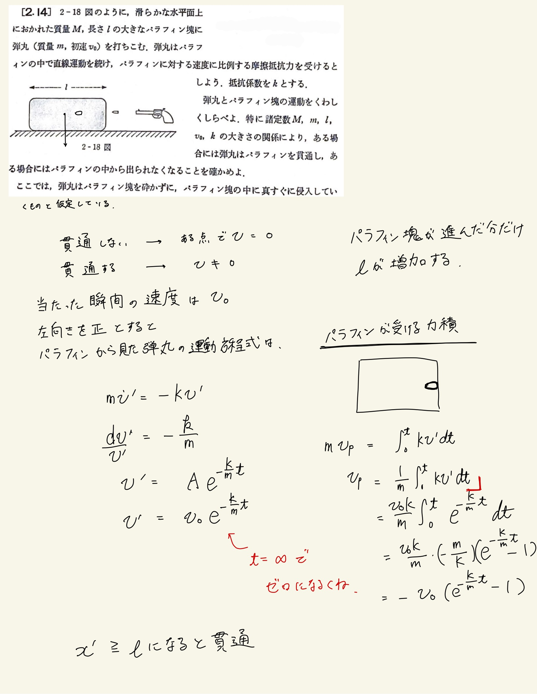
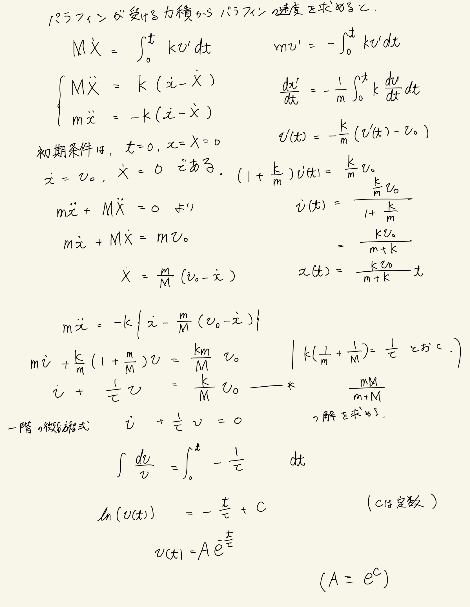
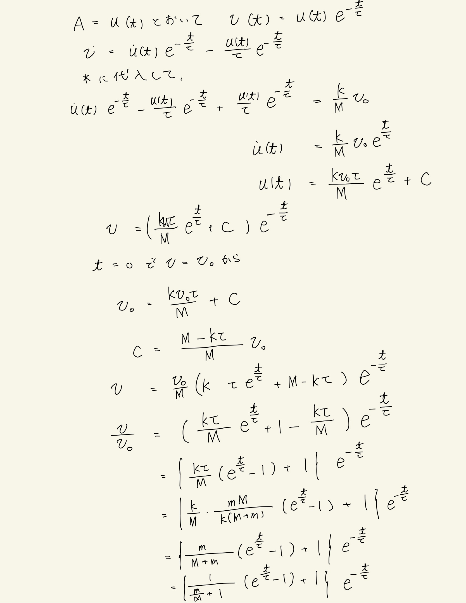
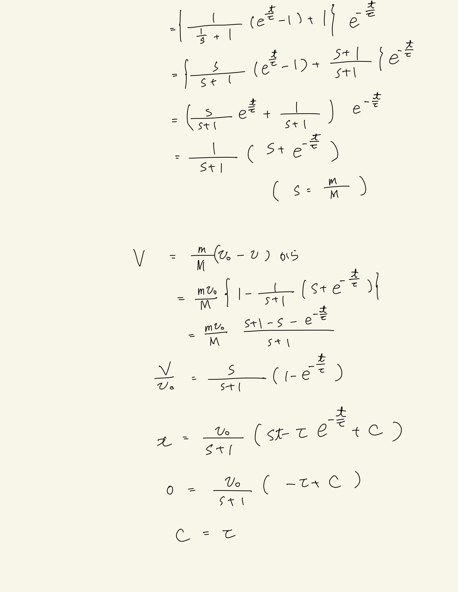
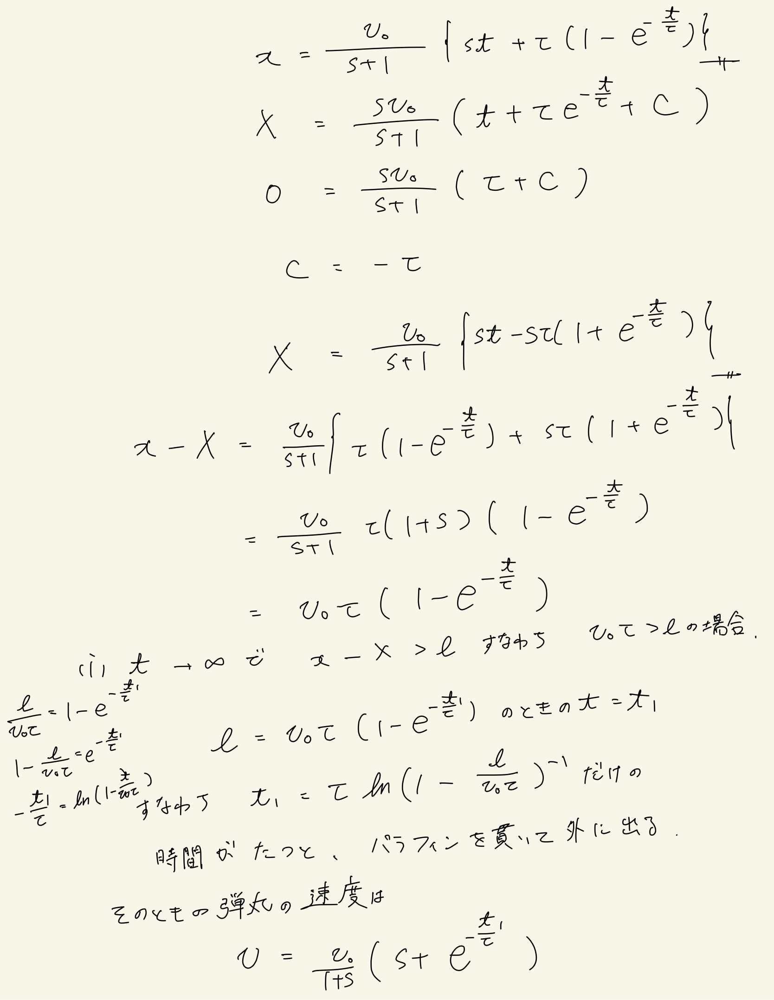
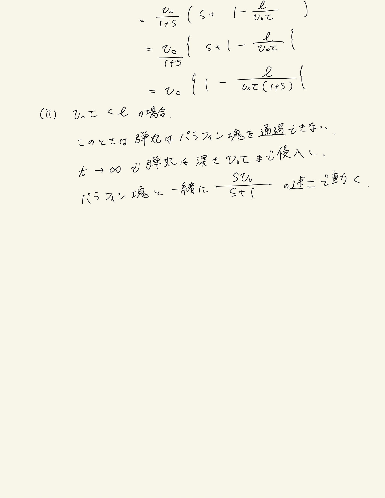

# 質点の運動法則
## 2.14 パラフィン塊を貫通する弾丸の運動方程式

 

最初は力積から解こうとしてましたが普通に運動方程式立てればよかった。
抵抗が相対速度に比例するってとこから自力で運動方程式立てるまではよかったけど、非斉次方程式の解き方を完全に失念していたので詰んだ。答えを見た上で式変形がかなりだるかった。

 

* ポイント
    * 抵抗は相対速度に比例
    * 作用・反作用から運動方程式を立てる
    * 非斉次方程式を変分法で解く

