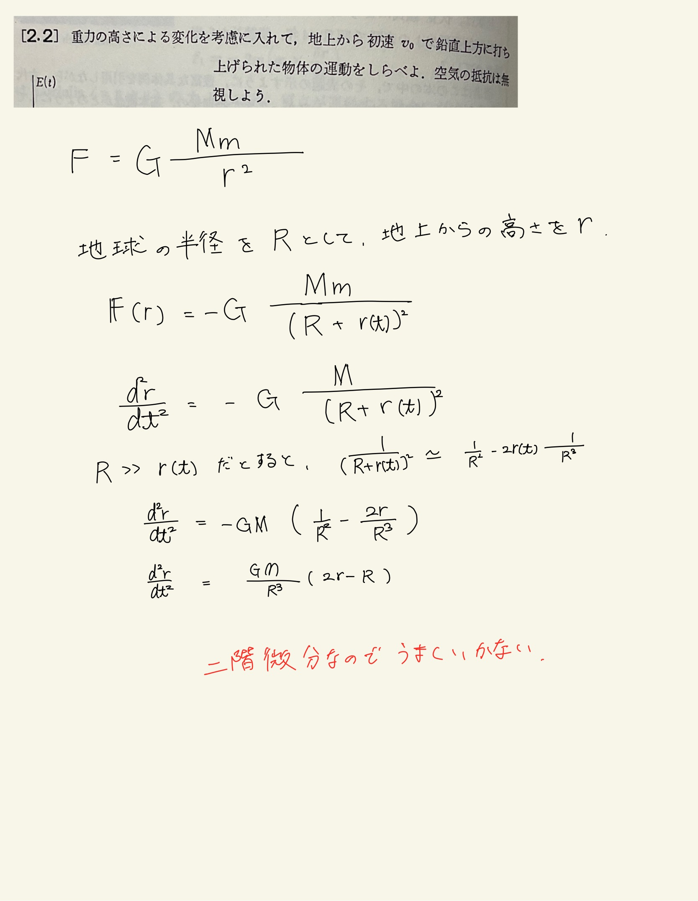
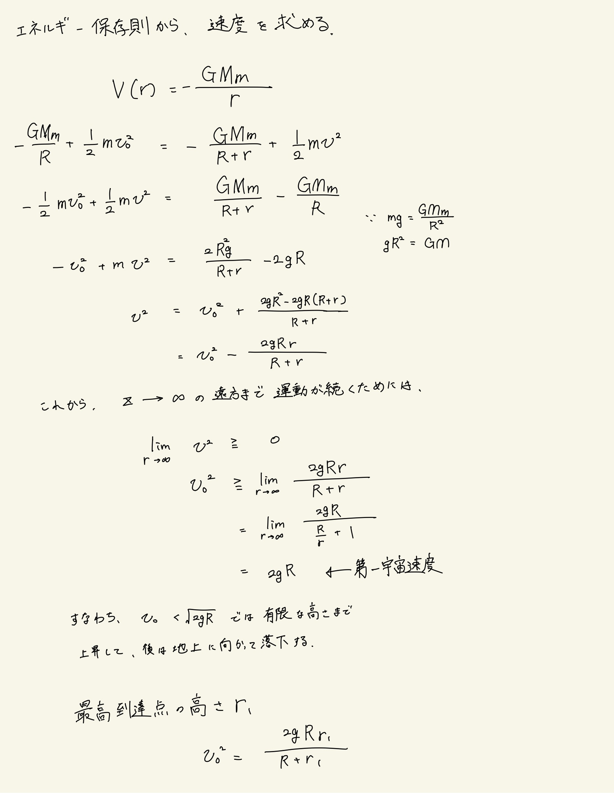
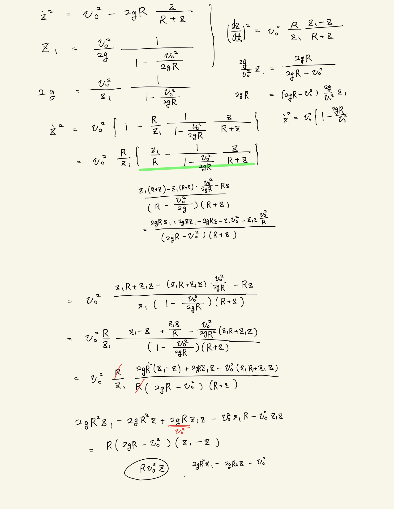
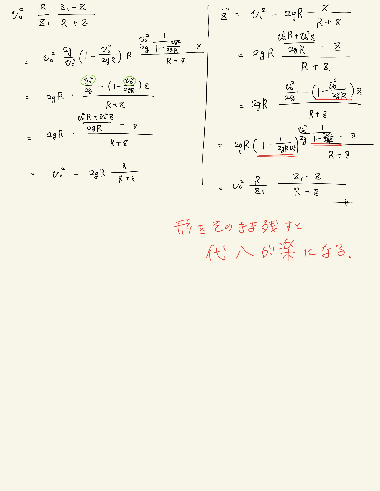
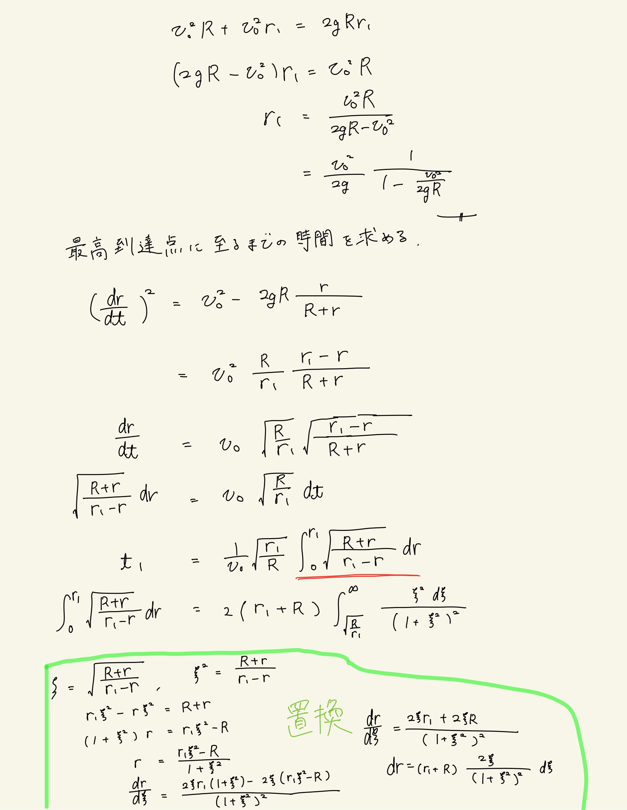
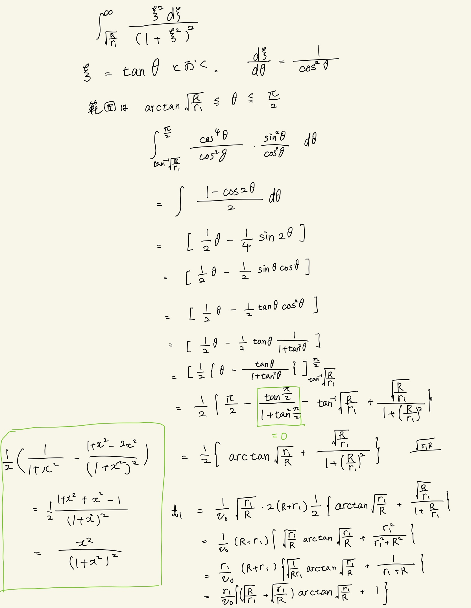
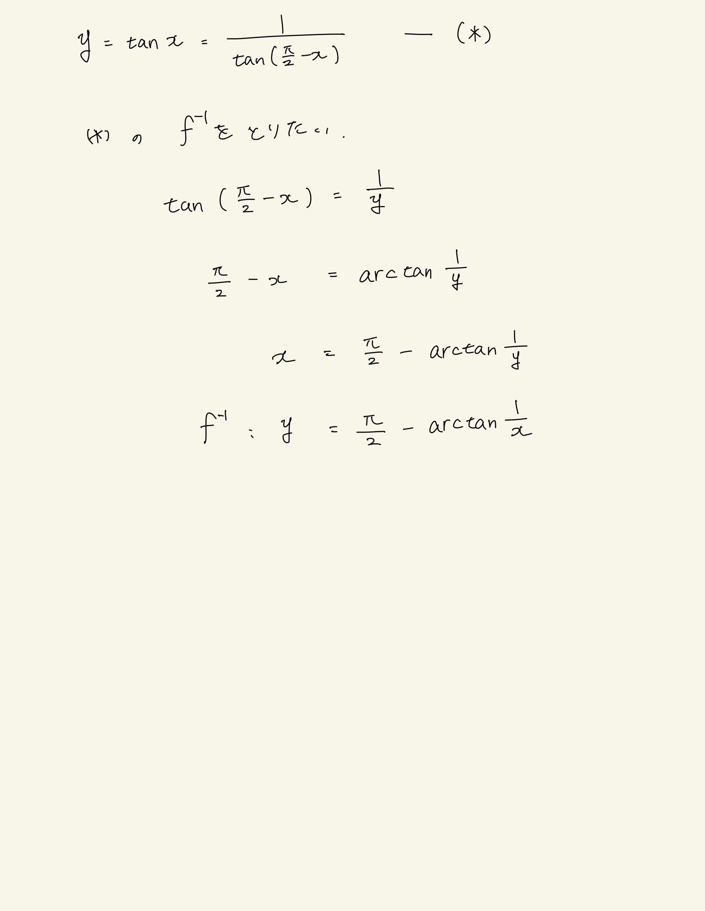

# 質点の運動法則
## 2.2 鉛直投げ上げ運動(万有引力で解く場合)

1次にしたかったのでテイラー展開で解こうとした。どっちにしろ非斉次方程式になったので萎えた。エネルギーの式にして1次にした。本の解答では運動方程式からエネルギー保存速導出してたけど別にいいよね...
速度をわざわざ$z_1$で置き換えるところが面倒だった。まぁそれでarctanの積分の形でできるのでそのためだと思う。
式から$\frac{\pi}{2}$を消去するために三角関数の周期性$\tan \theta = \tan^{-1}(\frac{\pi}{2}-\theta)$を用いる。用いた。
そうすると$ \arctan x = \frac{\pi}{2} - \arctan \frac{1}{x}$

 

