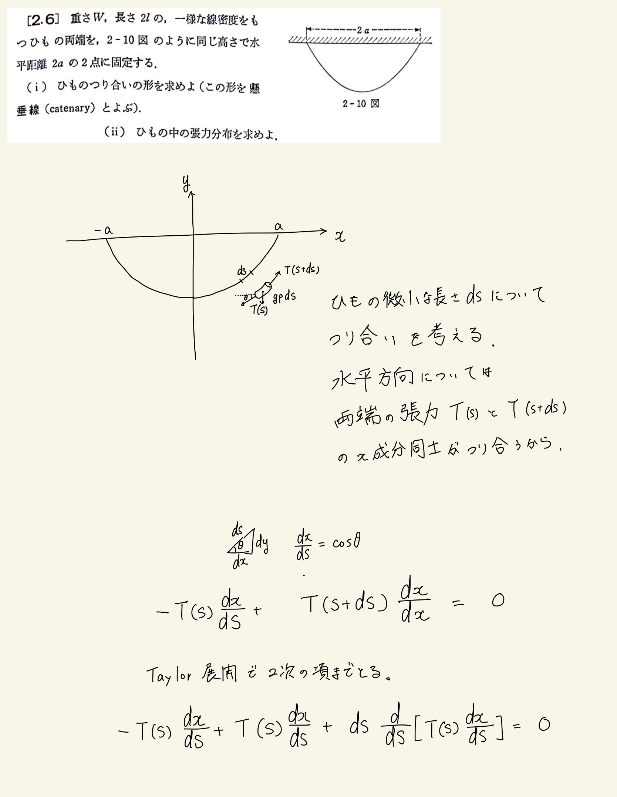
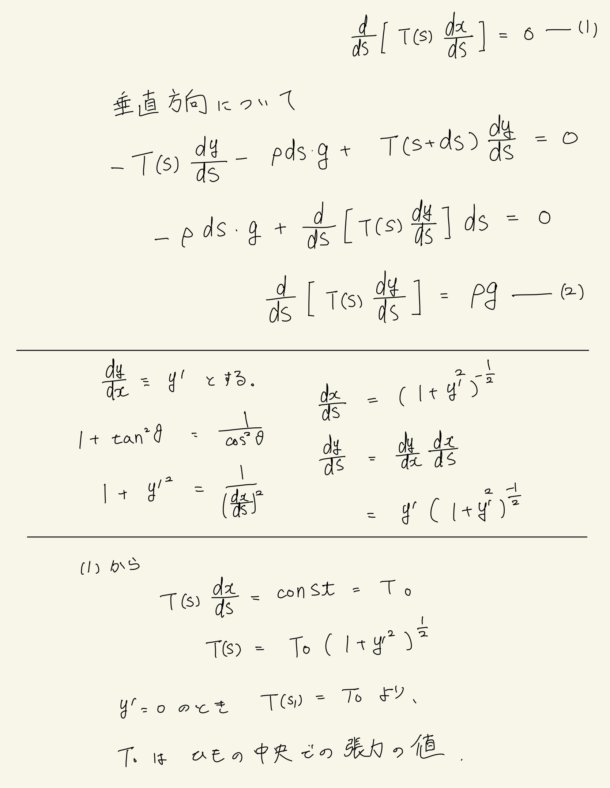
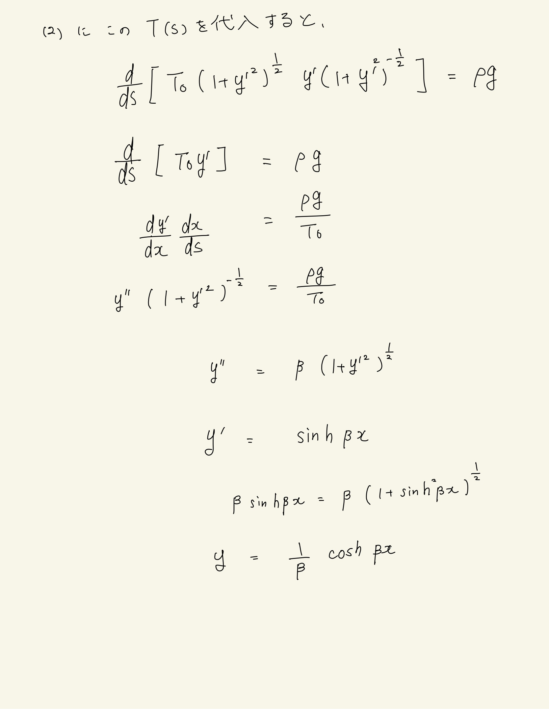

# 質点の運動法則
## 2.6 カテナリー曲線

 

紐に沿った長さの媒介変数sを使って運動方程式を立てる。微分の関係から$y=f(x)$に関する微分方程式を導く。この形の微分方程式の解き方がいまいちわかっていない。解説のやつはよくわからない置き換えをしていた。とりあえず$f''(1+f'^2)^{-\frac{1}{2}}=0$の形の微分方程式は双曲線関数が解になるっぽい。

 

