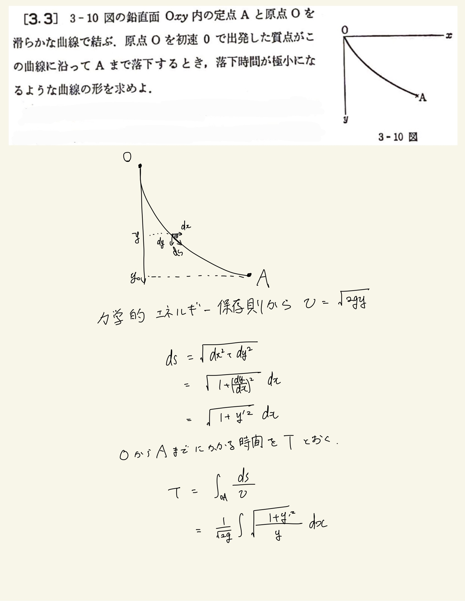
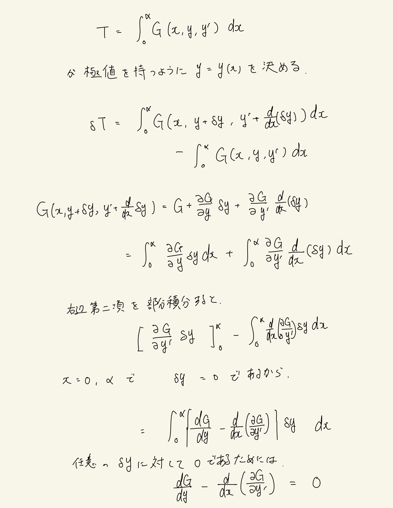
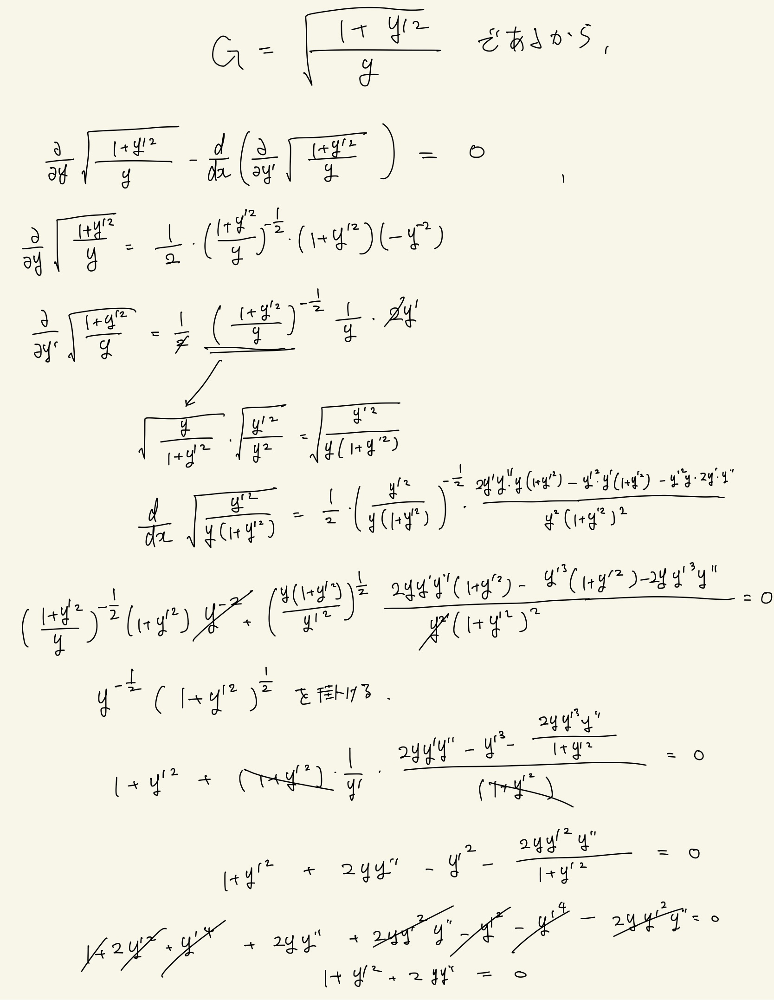
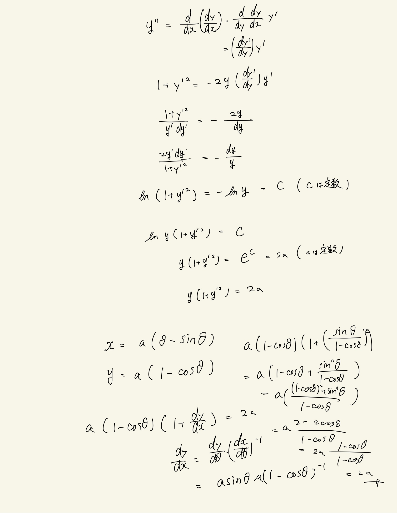

# 質点の力学的エネルギー
## 3.3 最急降下曲線(変分法を使った求め方)

積分の立式までいけたのでよしとする。
 
Euler方程式に今回の$G$(ラグランジアン)を代入した計算がクソだるかった。これもう少し簡単に計算できませんの...?何回もやり直した。いや普通に計算慣れてない。あと微分方程式を解くの無理ゲーすぎる。$y''=(\frac{dy'}{dy}y')$で置き換えるやつ思いつかへん。し、もっかい積分するのに関してはマジでわからん。
 
Euler方程式について、
$$\frac{d}{dx}(\frac{dG}{dy'})=\frac{d}{dx}\frac{dG}{d(\frac{dy}{dx})}=\frac{d}{dx}((\frac{dy}{dx})^{-1}G)\frac{d}{dy}G=\frac{d}{dx}\frac{dx}{dy}G=\frac{d}{dy}G$$
みたいな式変形を考えると覚えやすい。
 

