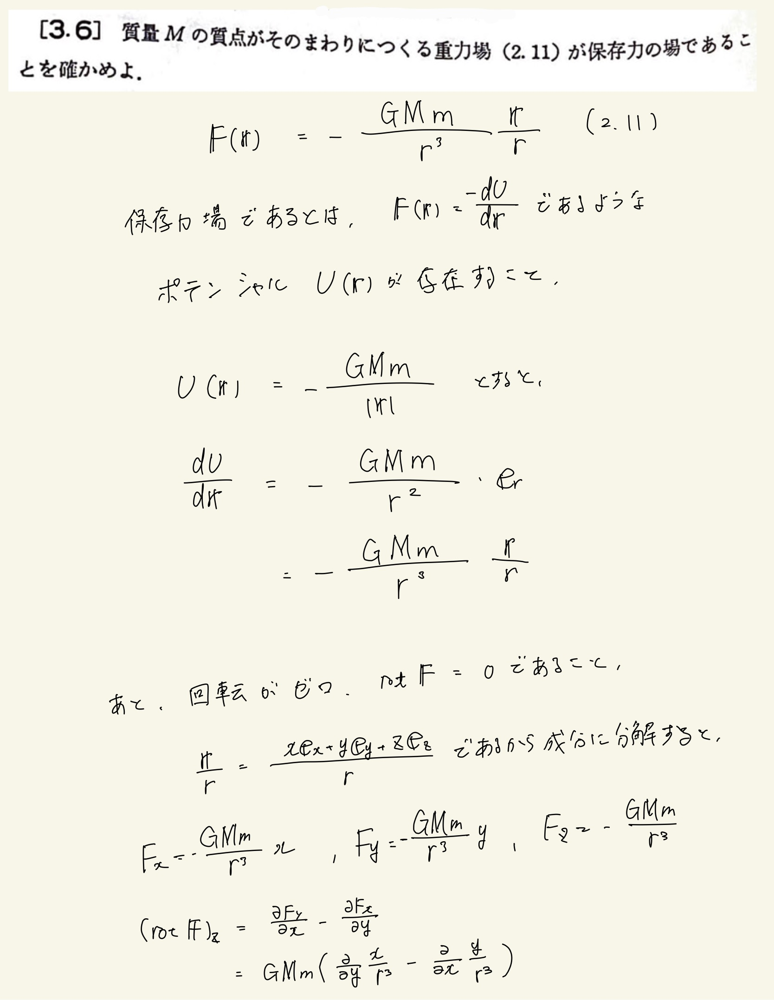
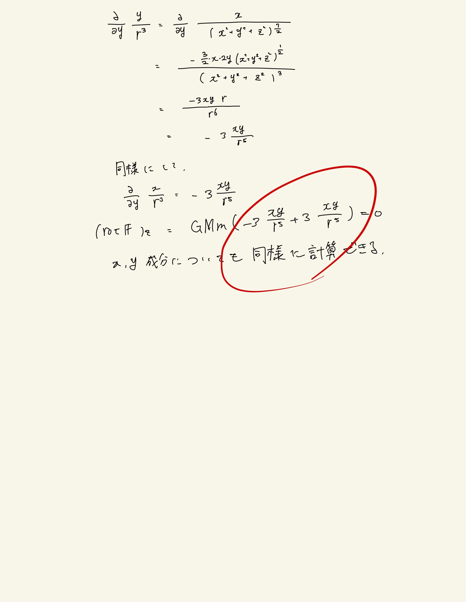

# 質点の力学的エネルギー
## 3.6 重力場が保存力場であることの証明

<方針>
 
ある力の場が保存力場である必要十分条件は二つある。
 
* $ \bm{F}(\bm{x}) = \frac{ d \bm{U(\bm{x}))} }{ d \bm{x} } $ であるようなポテンシャル$U(x)$が存在する
- $rot \bm{F}(\bm{x}) = 0$
 
上の条件を使って求めればOK
 

 