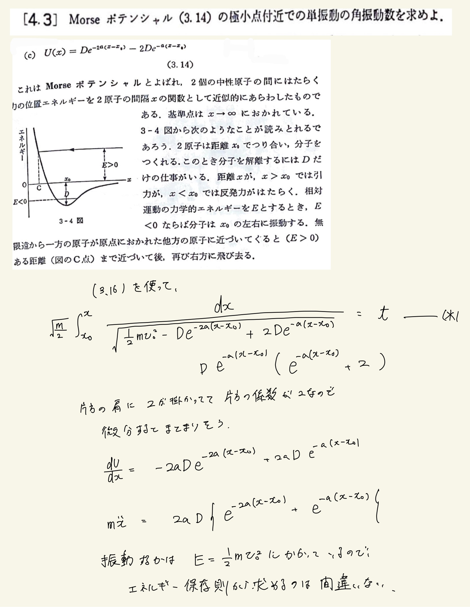
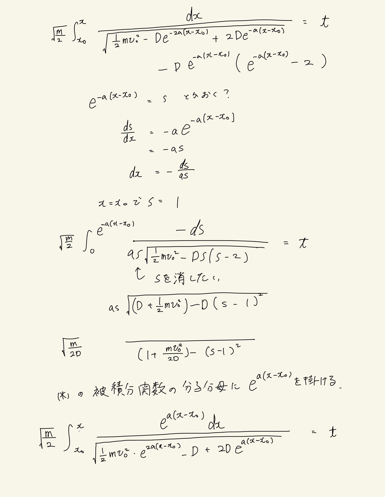
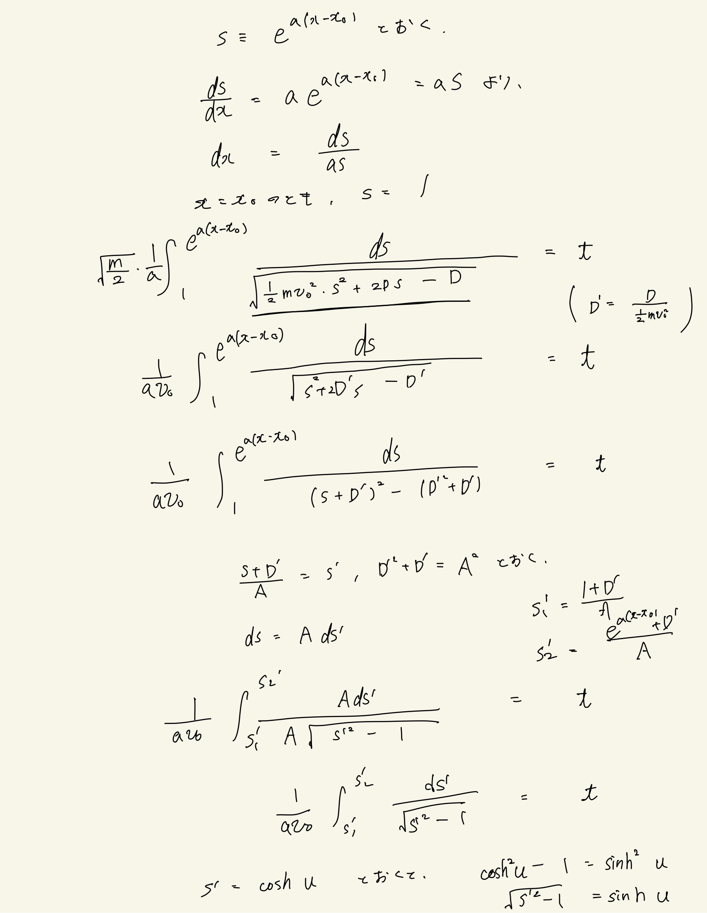
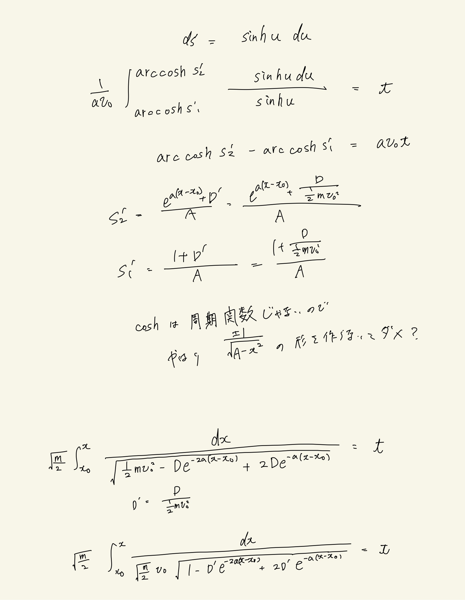
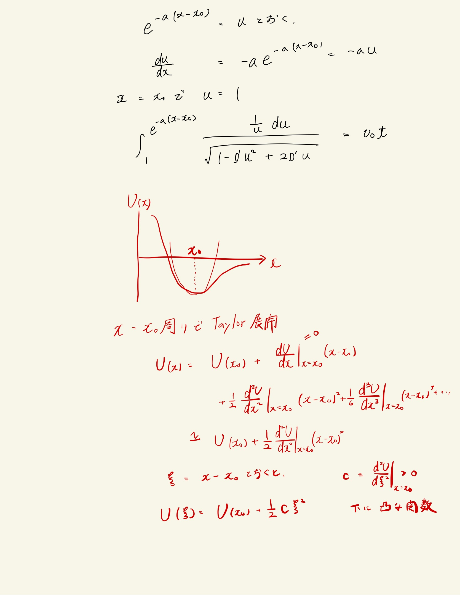

# 振動
## 4.3 ポテンシャルの極焦点付近での運動

 

頑張ってエネルギー積分したら$arccosh$とかになってどう見ても周期運動しなくて萎えた。
 
あとから考えると、"""ポテンシャル付近では2次で近似できて単振動をする"""ってことを考えると$arccosh$出てくるのは至極妥当な気がしてきた。$x=x_0$で極焦点をとる$cosh$の形をしていそう。
 

$x=x_0$周りでTaylor展開すると2次の項を位置エネルギーとした単振動をする。$\xi=x-x_0$とおくと、$\xi$の関数としてポテンシャルが書ける。下に凸なポテンシャル関数があればその極焦点付近では二次関数で近似されるため、単振動をするはずである。このように、単振動は非常に一般的な運動の型であると言える。