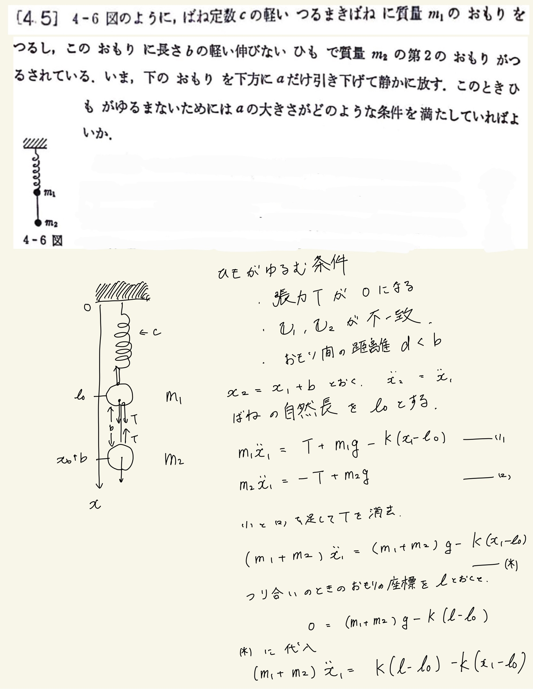
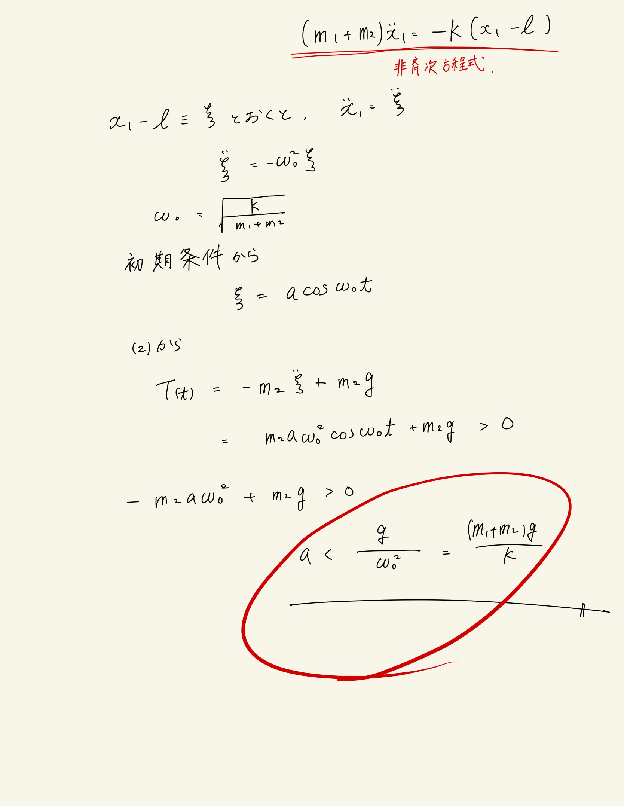

# 4 振動
## 4.5 鉛直バネ振り子(2)

 

ひもが緩む条件を最初に書き出した。ゆるんだあとのことを考えるのは難しいので($T$の計算がわからん)、$T$が$0$になる瞬間について解くと良さそうだった。その瞬間自体は$\dot x_1 = \dot x_2$。また、$x_2 = x_1 + b$であるから、運動方程式をそのようにして立てることができる。
 
基準点をずらした単振動になるので釣り合いの位置からを原点とした新しい座標$\xi$を使うと微分方程式を解くのが楽。非斉次方程式って書いたけど多分違うよな。。。
 

