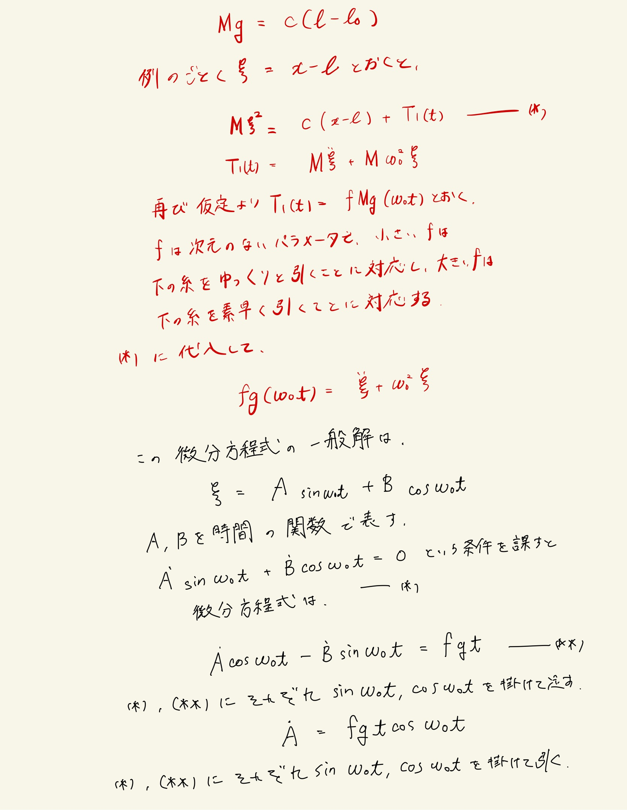
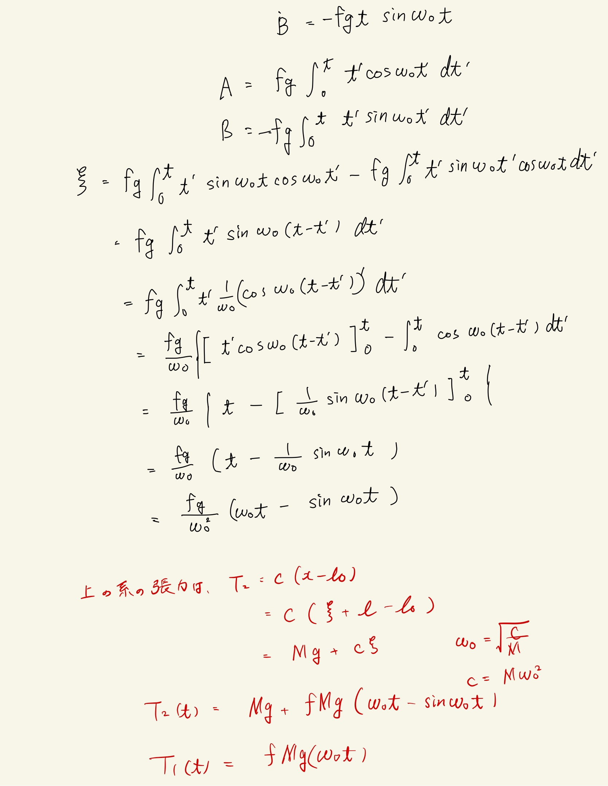
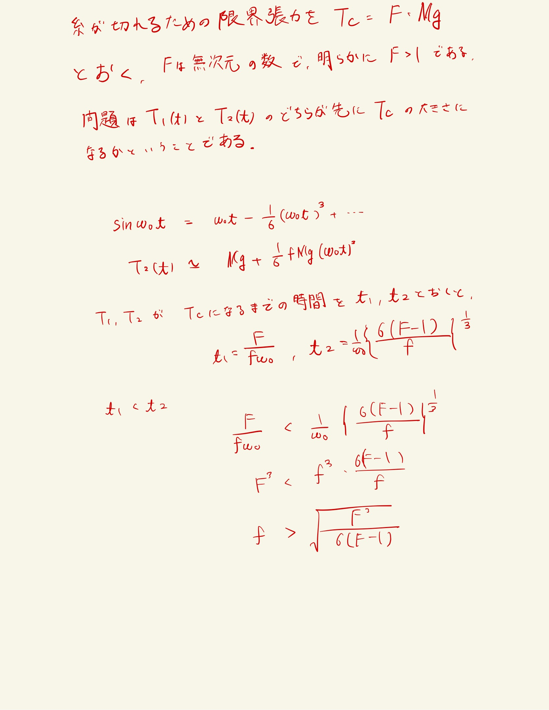

# 振動
## 4.6 張力の限界値

 

微小部分について過程を使って微分方程式を立てようとして方針を見失った。
 
上と下で張力を区別して、境界条件としておもりの運動方程式を使うのが解説。賢い。
 
ここでも例に漏れず、釣り合いの式から変数を減らして、釣り合いの位置を原点として座標を設定し直す。そうすると、非斉次方程式になるので変分法を使って解く。
 
解説では導出済の公式を使っていたが、ここではゼロから導出した。
 
(*)という条件を勝手に課すことで定数が積分の形で求まる。
 
外力$fg\omega_0t $なので積の形になってるので部分積分を使って解く。
 
張力が求まれば、時間の関数として時間について評価する。
 

 
引っ張ったら大体反対向きに力かかるし、一般の強制振動の式めちゃくちゃ汎用性高くね？？？と思った。変分法でわりかし簡単に解けるし天才。