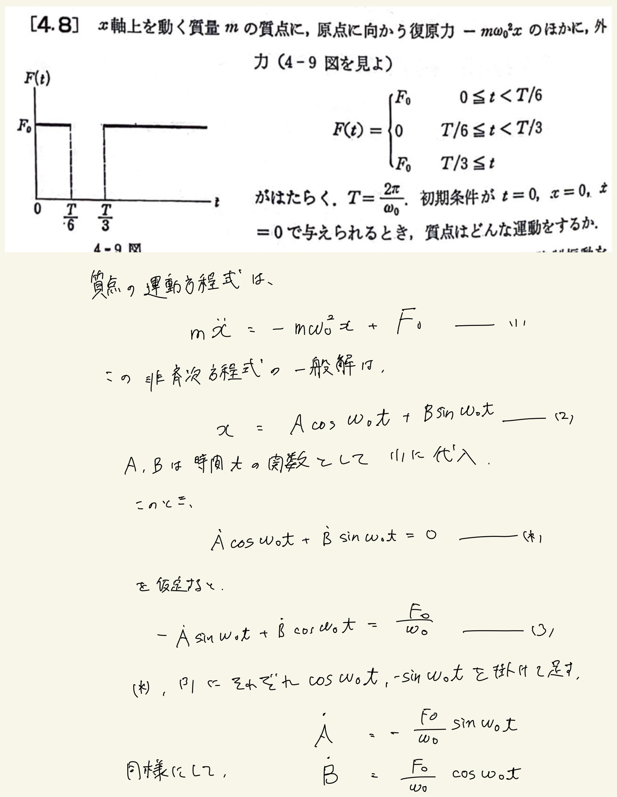
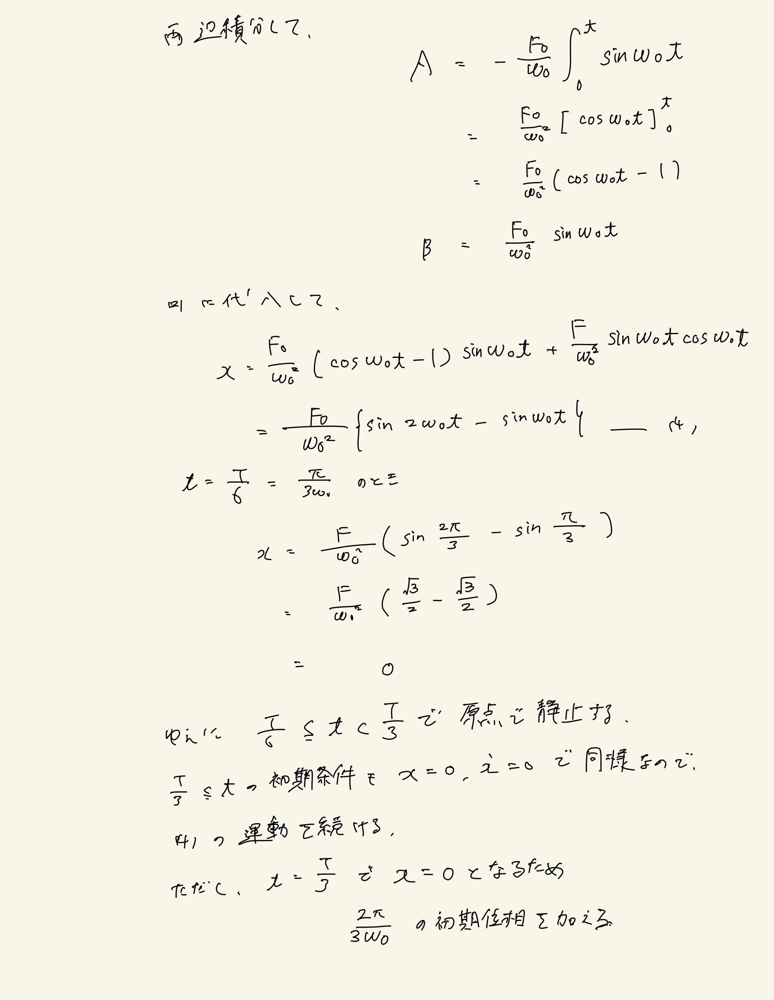
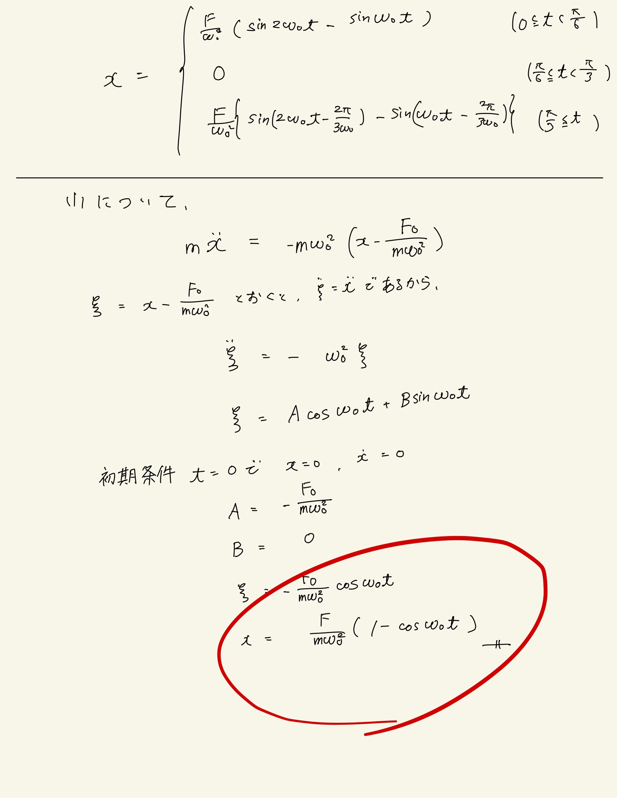

# 振動
## 4.8 強制振動(1)

一般の強制振動の式を導出して解こうとしたらなんかダメだった。
 

諦めて公式を使うべきだったかもしれない。

 

$F_0$が一定なので、鉛直バネ振り子のときと同じく基準点をずらしてやれば簡単に解ける。

 

解説が、$ \frac{\pi}{6} \leqq t < \frac{\pi}{3} $で謎に$ F_0 \neq 0 $だったので解説は信用しない。ただし、$ t = \frac{T}{6} = \frac{\pi}{3\omega_0} $で$ ( 1 - \cos \frac{\pi}{3} ) = \frac{1}{2} \neq 0 $なので外力はなくても復原力ははたらくはず。