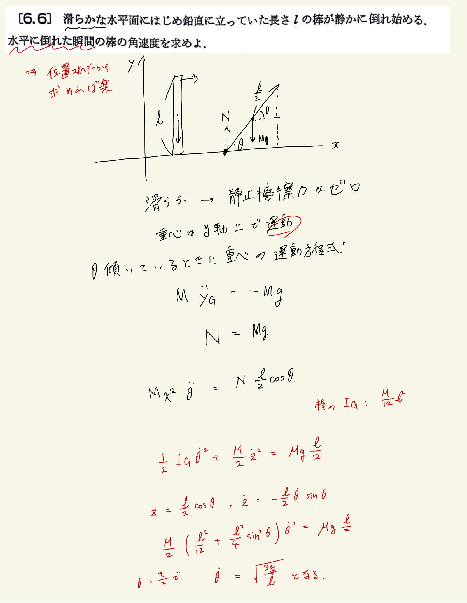

# 剛体
## 6.6 剛体(棒)の運動

剛体の運動 → 運動方程式と角運動量の方程式を立てる。
 
棒が倒れるかみたいなやつは座標が$\theta$で書けるので角運動量の式にねじ込むことができる。僕の回答だと倒れることによるトルクを項に入れ忘れていますね。重心からのトルクは抗力と運動の和になるのでそれを考慮する。
 
*解説はエネルギー保存則から解いてるな。今気づいたわ。
 
求めたいのは倒れる瞬間の角速度なので$ \dot \theta $と$ \sin ^2 \theta $とかいう面倒な方程式は解かなくても良い。(次の問題で明らかになることだが$ \sin \theta $と$ \dot \theta $の微分方程式は相性が良くて、$ \sin ^2 \theta  $ を微分すると$ \dot \theta $が出てくるので多分わりかしきれいに解ける。)
 

 
代表的な剛体の慣性モーメントくらいは覚えておいた方が良さそう。覚える。
