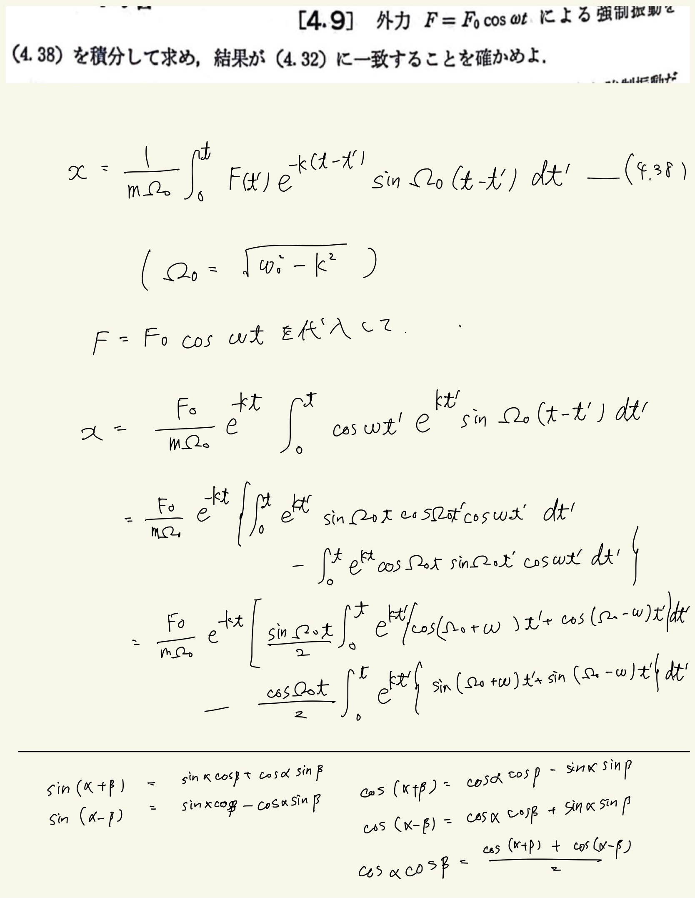
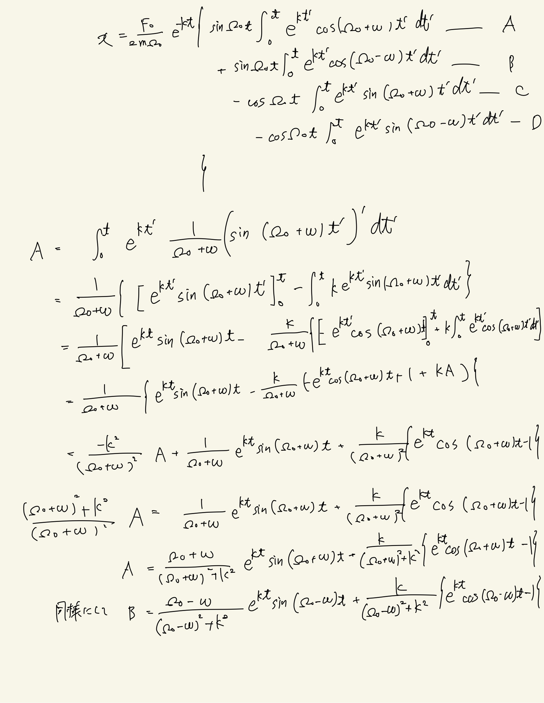
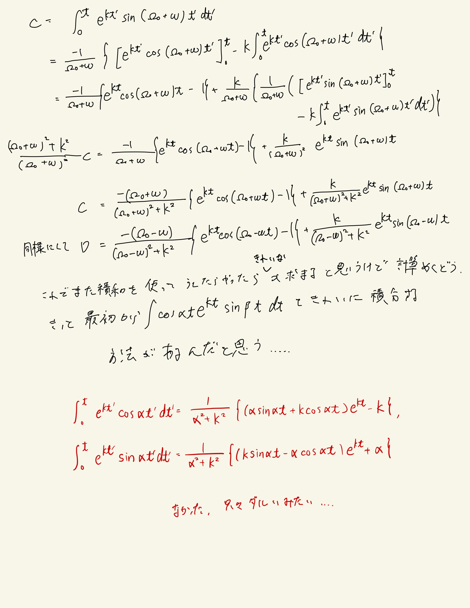

# 振動
## 4.9 強制振動(2)

変形がとてもめんどくさい。積和を使って積分を簡単にする発想が自然に出てきたのでそこはセンスが身についてきた感があって嬉しかった。
 
公式を使って解けよという話なので覚えておくべきかもしれない。
 

 

解説では減衰振動の項と強制振動の項に分けて、いい感じ$\alpha, \gamma$って変換して(4.32)に一致することを確かめてた。三角関数の合成をうまい具合に使ってやればできる(面倒)。