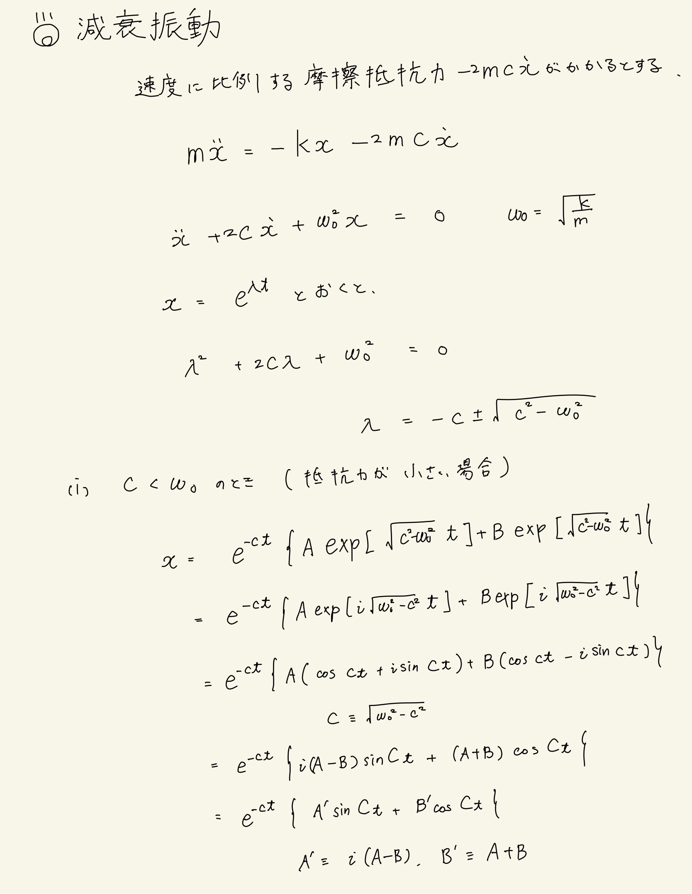
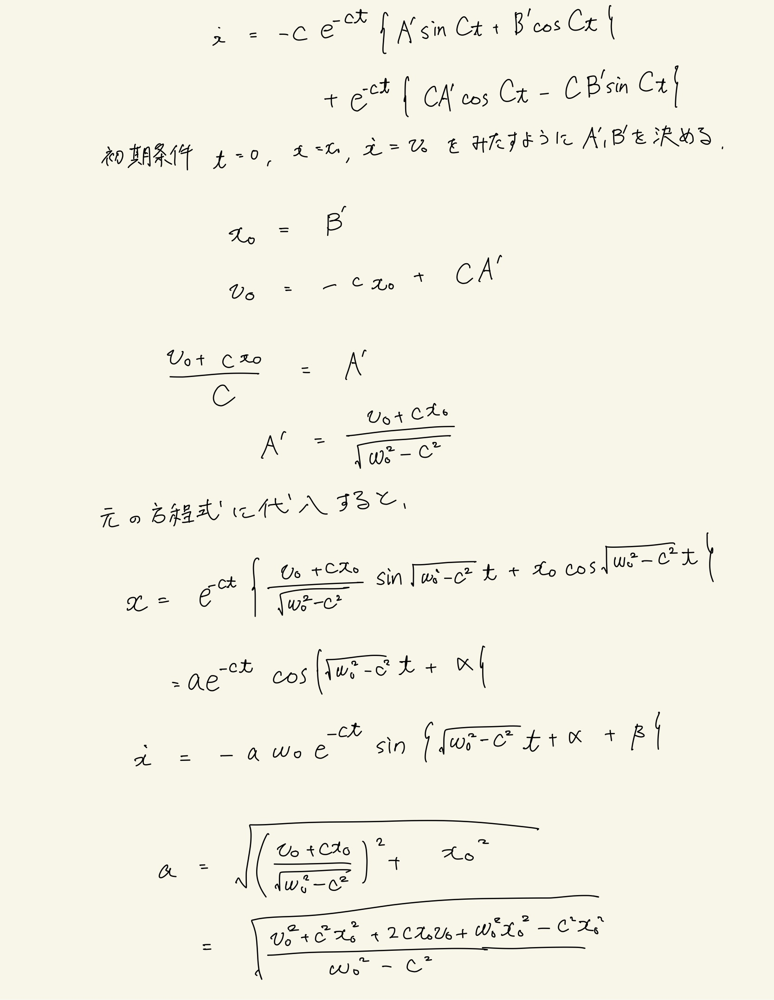
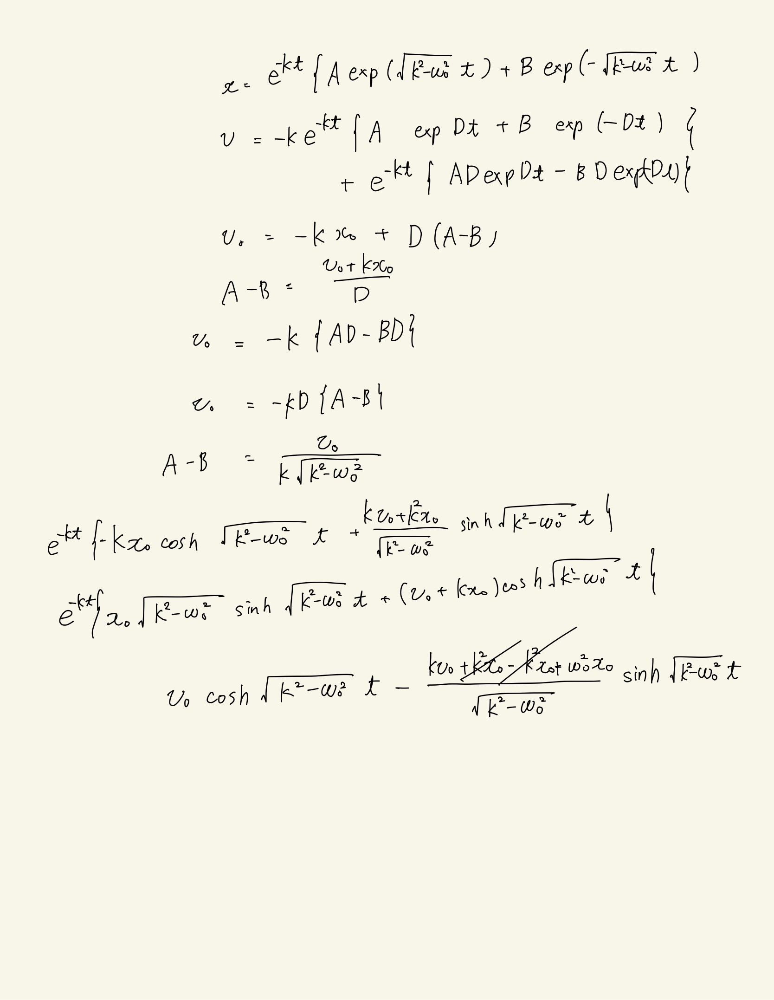

# 振動
## 減衰振動

質点に、原点に向かう力$-cx$のほかに、速度に比例する抵抗$-k \dot x$がはたらく場合を考える。
 
運動方程式は
$$ m \ddot x = - cx - 2mk \dot x (k > 0) $$
で与えられる。書き換えると、$c = m \omega _ 0 ^2 $ とおいて、
$$ \ddot x + 2k \dot x + \omega_0 ^2 x = 0 $$
$ x = e^{ \lambda t} $ を代入すると、
$$ \lambda^2 e ^{\lambda t} + 2k \lambda e^{\lambda t} + \omega_0 e^{\lambda t} = 0 $$
$$ \lambda ^ 2 + 2k\lambda + \omega_0 = 0 $$
$$ \lambda = -k \pm \sqrt{k^2-\omega_0^2} $$
 
次の3つの場合を考察する。
 
(i) $ k < \omega_0 $のとき(摩擦抵抗が小さいとき)
$A, B$を複素係数とすると、
$$ x = e^{-kt} \{ A \exp(i \sqrt{ \omega_0^2 - k^2 }t) + B \exp{(-i\sqrt{\omega_0^2 - k^2 } t ) }  \}$$
$$ e^{-kt} \{ A ( \cos \sqrt{ \omega_0^2 - k^2 } t + i \sin \sqrt{ \omega_0^2 - k^2 } t ) + B ( \cos \sqrt{ \omega_0^2 - k^2 } t - i \sin \sqrt{ \omega_0^2 - k^2 } t )\} $$
$ i(A-B) = A',A + B = B' $とおいて書き直すと、
$$ e^{-kt} \{ A' \sin \sqrt{ \omega_0^2 - k^2} t + B' \cos \sqrt{ \omega_0^2 - k^2 } t \} $$
$$ \dot x = -k e^{-kt} \{ A' \sin \sqrt{ \omega_0^2 - k^2} t + B' \cos \sqrt{ \omega_0^2 - k^2 } t \} + e^{-kt} \{ \sqrt{ \omega_0^2 - k^2} A' \cos \sqrt{ \omega_0^2 - k^2} t + \sqrt{ \omega_0^2 - k^2} B' \sin \sqrt{ \omega_0^2 - k^2 } t \} $$
初期条件$ t=0, x=0, \dot x=0 $を満たすように$A, B$を定めると、
$$ A' = \frac{ v_0 + kx_0 }{ \sqrt{ \omega_0^2 - k^2 } }, B' = x_0 $$
$$ e^{-kt} \{ \frac{ v_0 + kx_0 }{ \sqrt{ \omega_0^2 - k^2 } } \sin \sqrt{ \omega_0^2 - k^2} t + x_0 \cos \sqrt{ \omega_0^2 - k^2 } t \} $$
(ii) $ k>\omega_0 $のとき(摩擦抵抗が大きいとき)
 
根号の中が実数なのでそのまま解けば良い
 
一般解は
$$ x = e ^{-kt} \{ A \exp(\sqrt{k^2-\omega_0^2}t) + B \exp(-\sqrt{k^2-\omega_0^2}t) \} $$
$$ v = -k e ^{-kt} \{ A \exp(\sqrt{k^2-\omega_0^2}t) + B \exp(-\sqrt{k^2-\omega_0^2}t)\} + e ^{-kt} \{ A\sqrt {k^2-\omega_0^2}\exp(\sqrt{k^2-\omega_0^2}t) - B\sqrt{k^2-\omega_0^2}\exp(-\sqrt{k^2-\omega_0^2}t) \} $$
初期条件は$(t=0, x=x_0, v=v_0)$ 
$$ A + B = x_0, A - B = \frac{v_0+kx_0}{\sqrt{k^2-\omega_0^2}} $$
連立して解いて、
$$ A = \frac{1}{2}\{ x_0 + \frac{v_0+kx_0}{\sqrt{k^2-\omega_0^2}} \}, B = \frac{1}{2}\{ x_0 - \frac{v_0+kx_0}{\sqrt{k^2-\omega_0^2}} \} $$
代入してまとめると、
$$ x = e^{-kt}\{x_0cosh\sqrt{k^2-\omega_0^2}t + \frac{v_0+kx_0}{\sqrt{k^2-\omega_0^2}}sinh\sqrt{k^2-\omega_0^2}t\} $$
$$ v = e^{-kt}\{v_0cosh\sqrt{k^2-\omega_0^2}t - \frac{kv_0+x_0\omega_0^2}{\sqrt{k^2-\omega_0^2}}sinh\sqrt{k^2-\omega_0^2}t\} $$

(iii) $k=\omega_0$の場合
 
上の式から$ \omega_0 \rightarrow k $の極限をとる。
$$ x = e^{-kt} \{ x_0 + ( v_0 + kx_0 ) t \} $$
$$ \dot x = e^{-kt} \{ v_0 - (x_0 k^2 + kv_0 ) t \} $$
 

