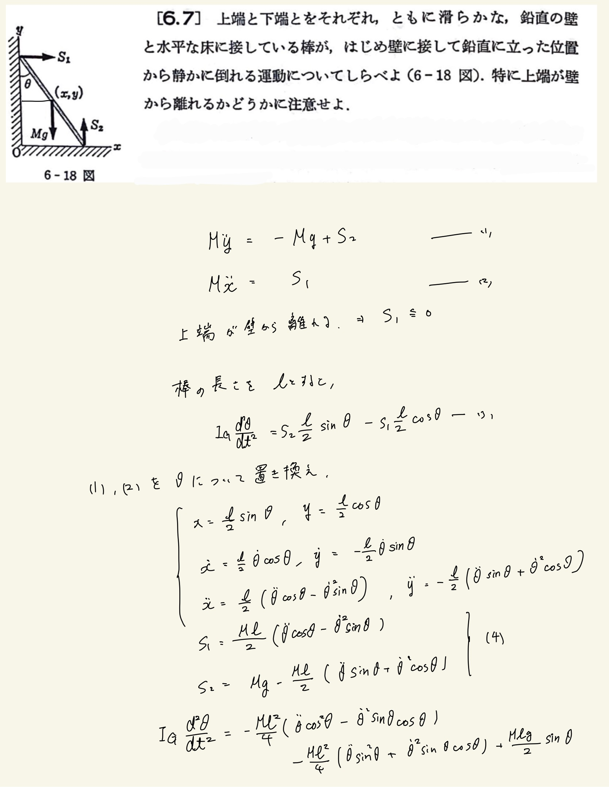
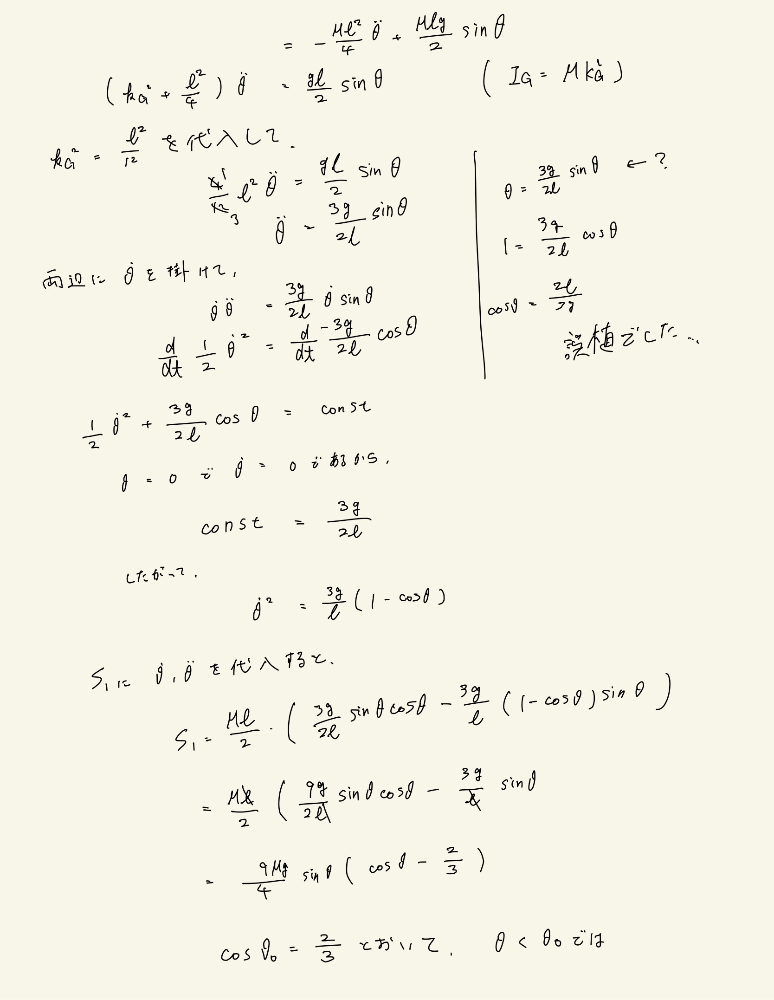
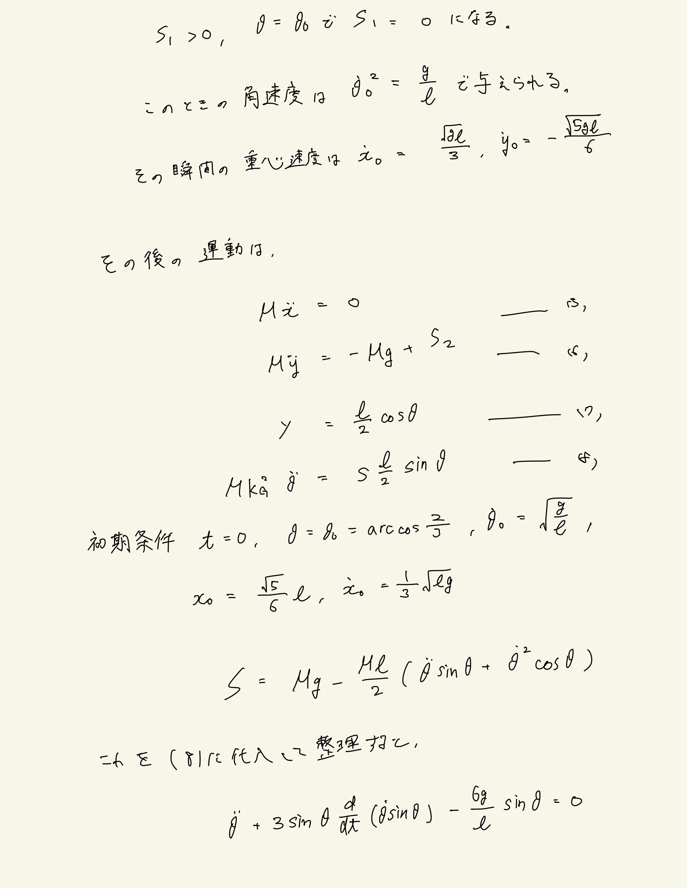
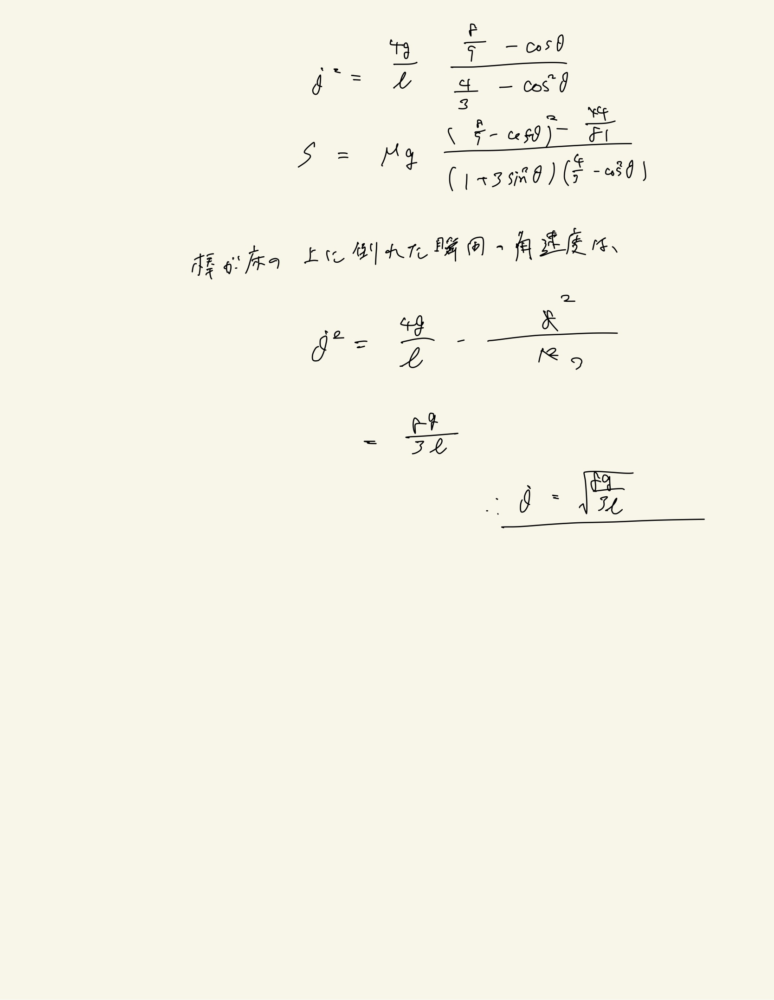

# 剛体
## 6.7 剛体(棒)の運動(2)

全問と同じ。微分方程式を解くところが難易度上がってますね。ここでもエネルギー積分の形を使った。めちゃくちゃ有能。てか最初からエネルギーで解けた？いや、左端が離れるかどうかで束縛条件を使うからダメだ。(6.1なら解けますね。解くか。)
 
$ \ddot \theta $が$ \theta $になってる誤植がありました。
 
剛体にありがちなのが、解に特異的な分数が出てくることで。パラメータ$ \theta $を適当にいじると劇的に運動が変わるということが起こる。今回は$ \cos \theta $に対して分数$ > 1 $なので、気にすることはなさそう。
 

