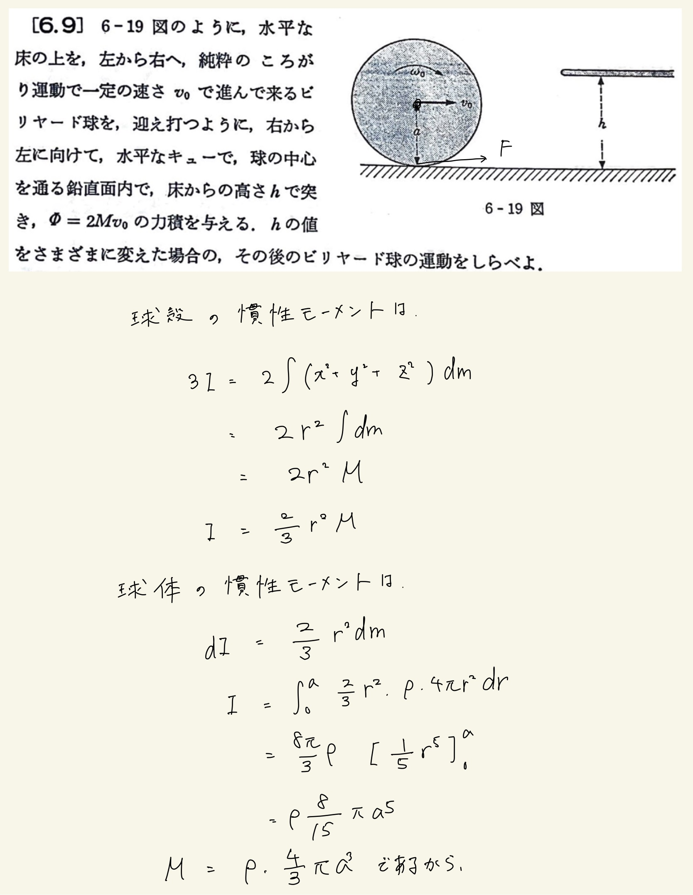
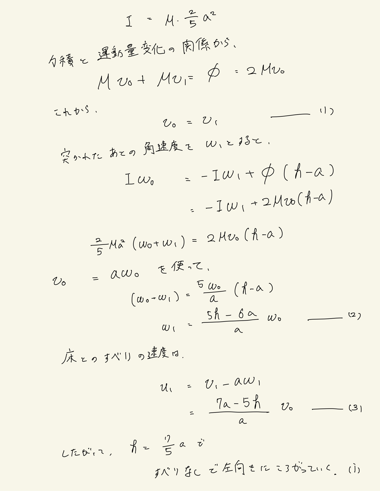
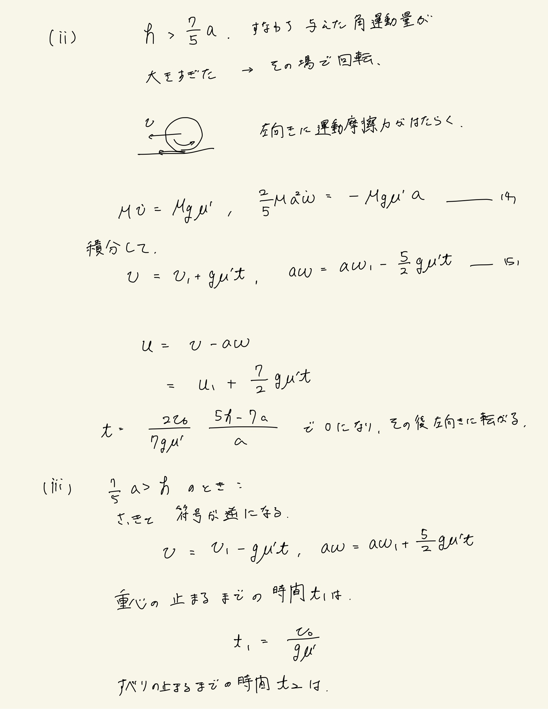
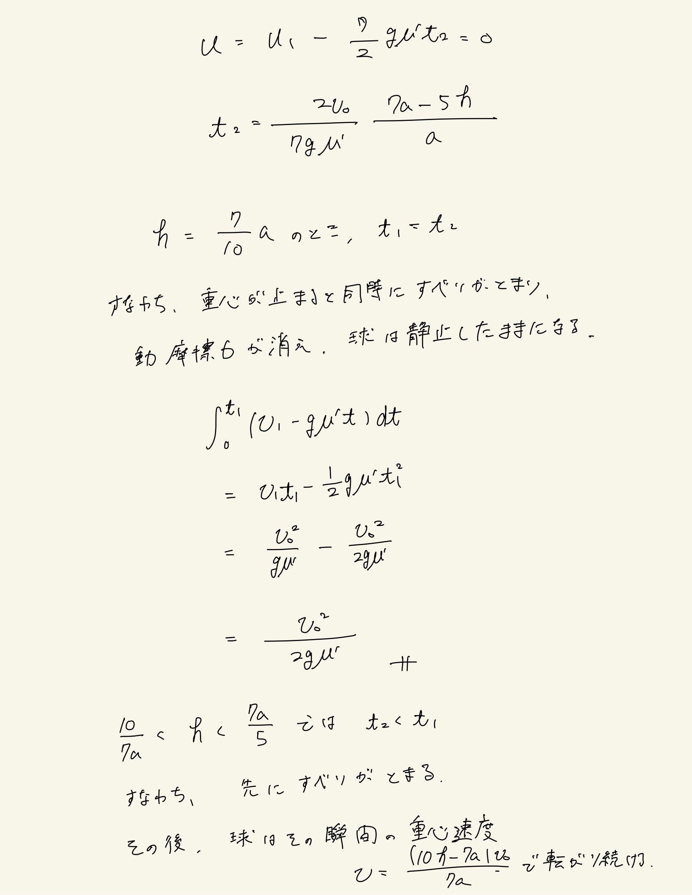
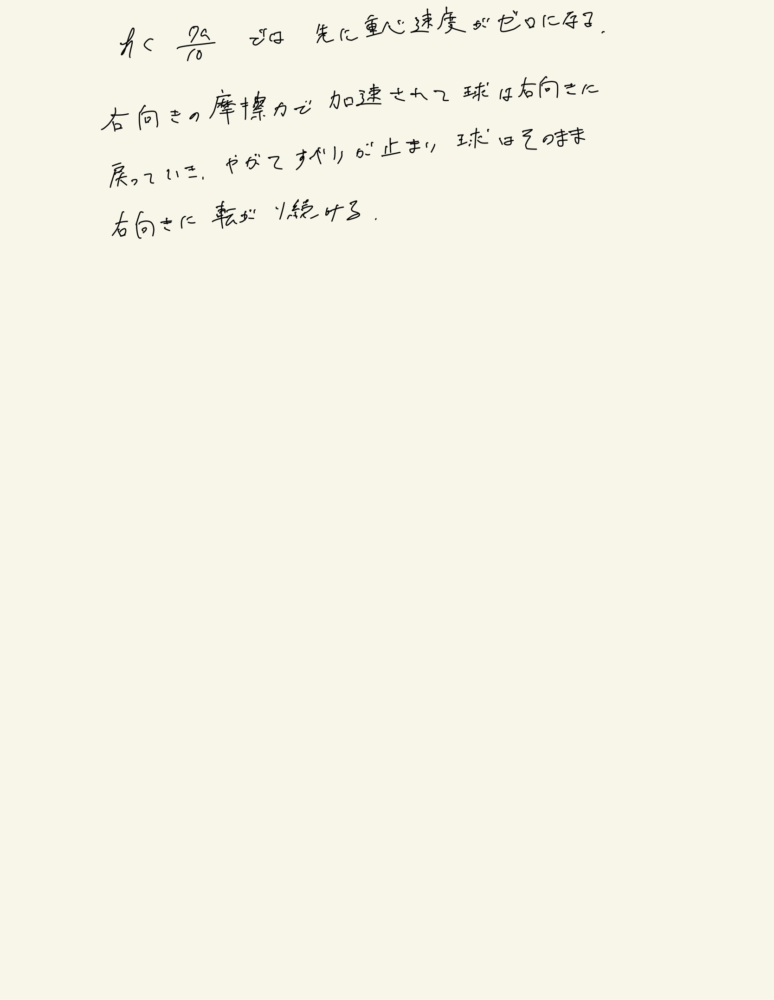

# 剛体
## 6.9 ビリヤードの球

与えられているのが力積なので、いつものようにトルクの式ではなく角運動量保存則の式を立てることで突かれた後の角速度を求める。
 
↑確かにここで摩擦力の項が出てこないのは気持ち悪いかもしれない。ただし摩擦力はトルクには影響するけど角運動量に影響することはないので$ \omega_1 $のなかに含まれてるんじゃねとか考えてる。結局、どこの位置で打つと滑りの速度が発生しないかは摩擦係数に関係なく決定する。
 
あとは場合分けをして、滑りの速度から運動の方程式を立てて時間について解く。そうすると再び走り始めるまでの時間が分かる。
 
$ h>\frac{7}{5}a $だと回転の邪魔をするように、$ h<\frac{7}{5}a $ だと回転を助けるように摩擦力がかかる。摩擦力を加えたトルクがゼロになるように角速度は決まるわけですな。
 
$ h=\frac{7}{10}a $という値も面白い。
 
重心が止まっているのに滑りの速度が生きてる→右向きの摩擦力が働いてビリヤードの球はバックスピンし始める。
 

