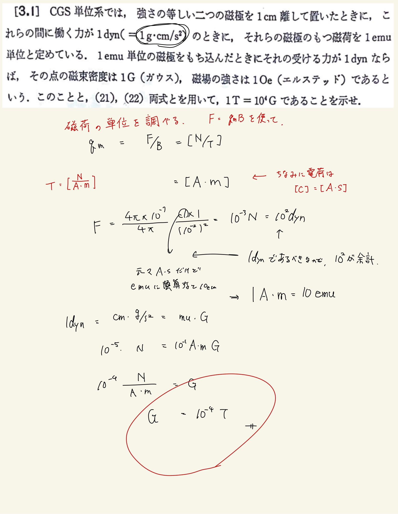

# 電流と磁場
## 3.1 CGS単位系

$ [ \mathrm{m} ] $を$ [ \mathrm{cm} ] $に、$ [ \mathrm{kg} ] $を$ [ \mathrm{g} ]$にするとCGS単位系に換算することができる。
 
 
上から$ 1 [\mathrm{dyn}] = 10^{-4} [\mathrm{N}] $というのは簡単に導くことができるが、磁場が磁気に加える力から計算しようと思うと、磁荷の単位がSI単位系にしてもわからないんで詰まってしまう(詰まってしまった)。
 
 
どうすればいいかというと、$ [ \mathrm{T} ] $と$ [ \mathrm{N} ] $を使って磁荷の単位を表してやればよい。そうすると、$ [ \mathrm{A \cdot m} ] $になっていることがわかる。まぁ電流が磁荷を作ることを考えるとわりかし自然な単位にみえるではなかろうか。ちなみに電荷の単位は$ [ \mathrm{A \cdot s} ] $である。
 
 
ここまでで準備は揃った。あとは$ [ \mathrm{dyn} ] $に変換したCoulombの法則から$ [ \mathrm{A \cdot m} ] $と$ [ \mathrm{emu} ] $の単位を比較してやればいい。
 
 

