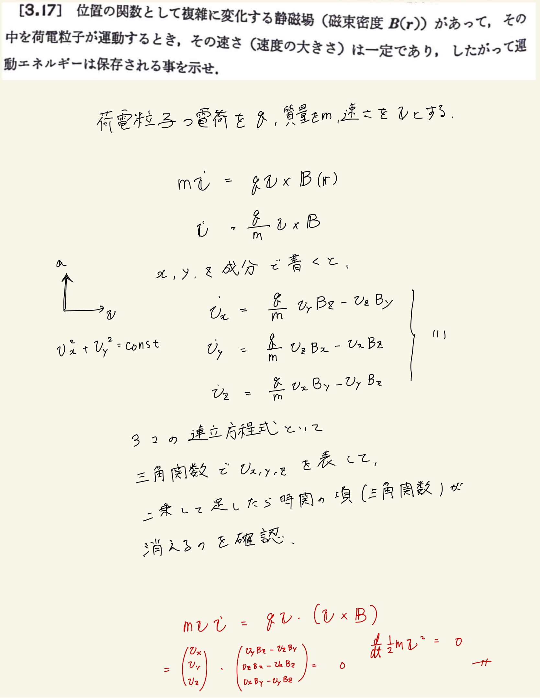

# 電流と磁場
## 3.17 静磁場内の運動エネルギー

成分全部計算すればいいやんとかとても面倒なことを思いついてしまったけど、たしかに死ぬほど使ってきたエネルギー積分をつかってやればすぐに確かめられる。
 
 
ベクトル解析の公式
 
$ \mathbf{A} \cdot ( \mathbf{A} \times \mathbf{C} ) = \mathbf{C} \cdot ( \mathbf{A} \times \mathbf{A} ) = 0 $
 
を使う。
 
 
上の公式は”スカラー三重積"といってわりかしよく使うやつなので覚えておくべき。てかスカラー三重積って立方体の体積を表してるんだから一個同じベクトルのやつ(方向余弦が同一)がいたら立方体潰れちゃって体積ゼロになるっていう直感が働くよね。
 
 
そういうわけで$ \mathbf{v} $を両辺にかけると右辺が消えるので運動エネルギーの時間変化がゼロになります。保存力場ってことがわかりますね。
 
 

