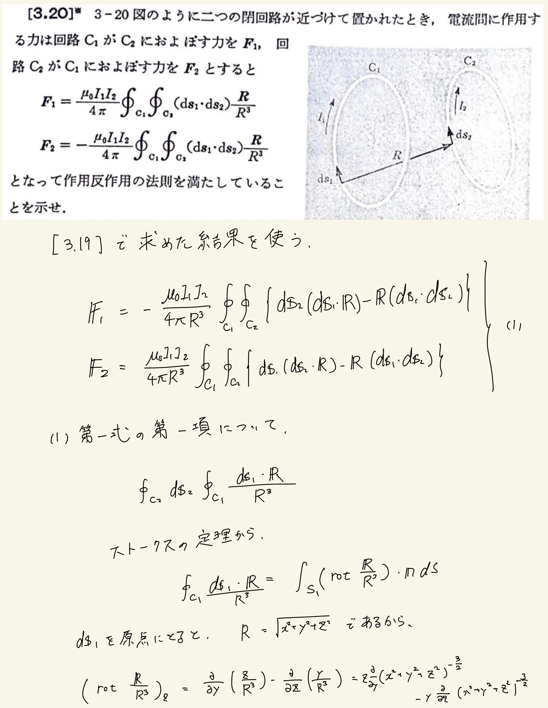
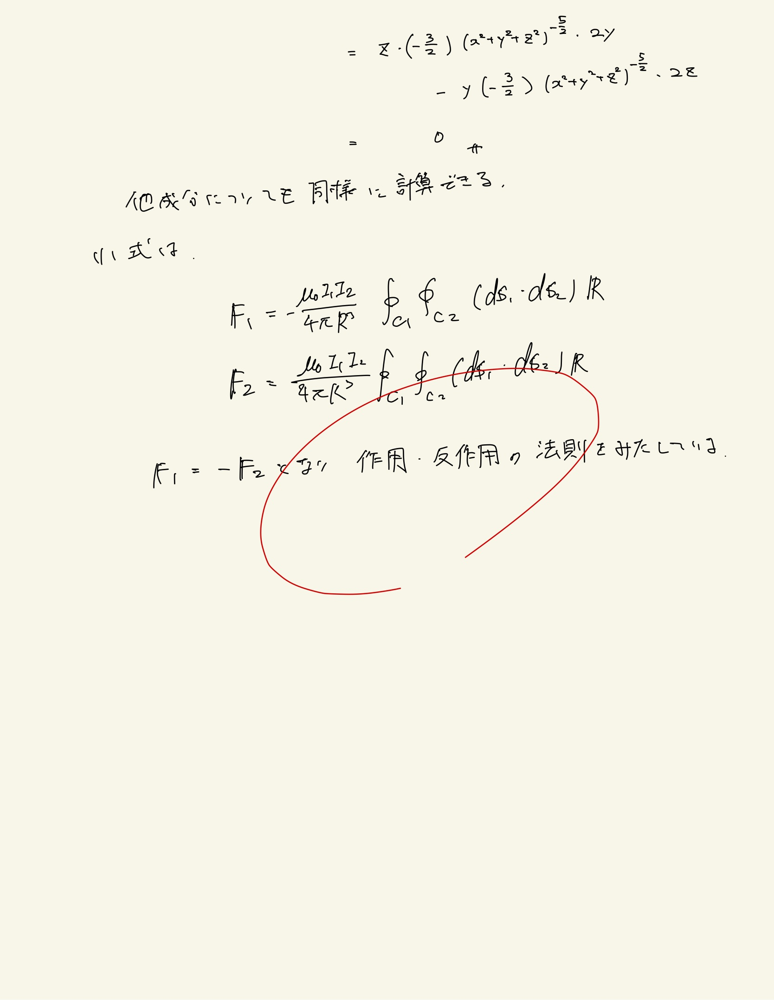

# 電流と磁場
## 3.20 電力間に作用する力

3.19で求めた電流素片間に作用する力を積分して電流同士に作用する力に変換してやる。
 
 
ストークスの定理を使うと面積分に変換できる。$ \mathrm{rot} \frac{ \mathbf{R} }{ R } = \mathrm{rot} \mathbf{e}_{ R } $はゼロになるらしい。
 
 
そうすると積分内の第2項だけ残り、これは共通するので作用・反作用の法則が成り立っていることがわかる。
 
 

