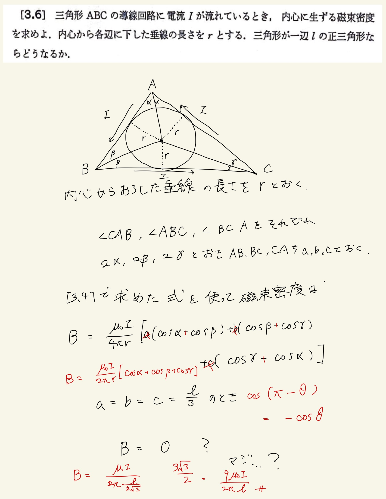

# 電流と磁場
## 3.6 三角形の電流が内心につくる磁束密度

直線がつくる磁束密度の式万能すぎる。
 
 
ただし角度の取り方を間違えてなんかゼロになったから焦って辺の長さの係数をつけてしまって答え間違えまくりました。
 
 
角度の取り方が内側になっているので$ \cos (\pi - \theta) = - \cos \theta $を使うとそれぞれ2倍になってきれいになります。あとは正三角形の垂線が$ \frac{l}{ 2 \sqrt{3} } $であることをつかって磁束密度を求める。
 
 

