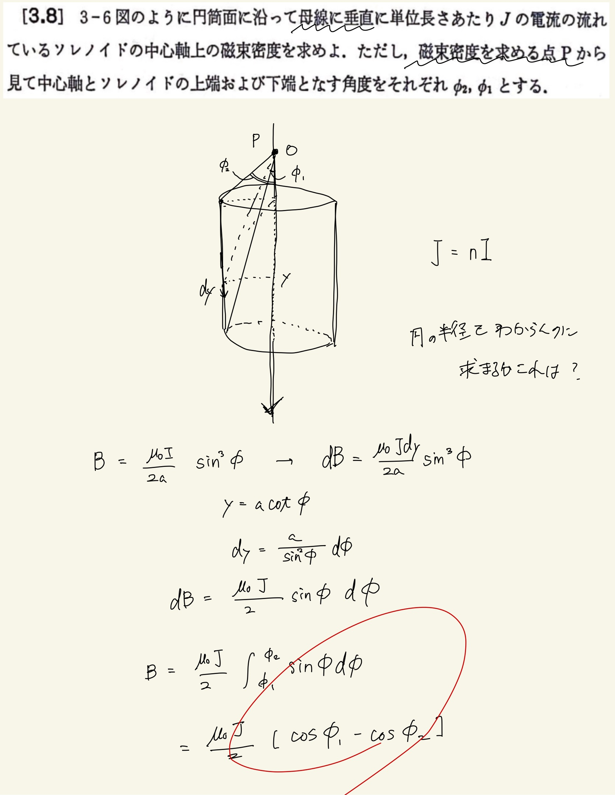

# 電流と磁場
## 3.8 ソレノイドのつくる磁束密度

単位長さあたりの電流なので、微笑長さをちゃんと定義してやる。P点を原点として下向きに$y$軸を設定して$ dy $を$ d \phi $で置き換えてやると積分がやりやすい。
 
 
そうするとなんと$a$が消去されるのでソレノイドの半径と中にできる磁束密度は関係がなくなる。この時点でソレノイドのなかの磁束密度が一定であることが予想されるのだがそれは次の問題でやる。
 
 

