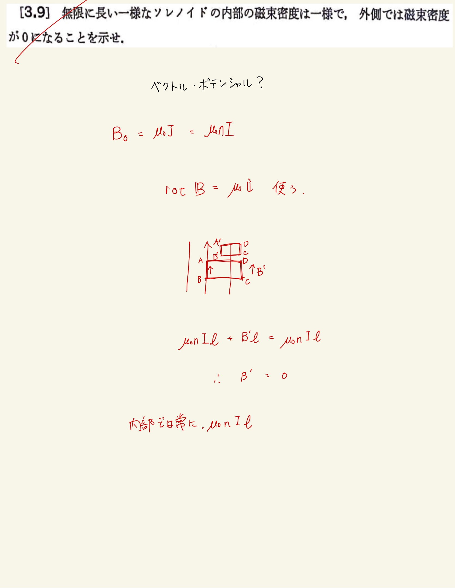

# 電流と磁場
## 3.9 Ampereの法則

最初なにも手につかなかった。たしか砂川電磁気のほうではベクトル・ポテンシャルを使って中の磁束密度が一定、外の磁束密度がゼロであることをしめしていたとおもうのだけど、ベクトル・ポテンシャルを覚えていないので詰みました。
 
 
実はAmpereの法則を使って示すことができる。ソレノイドの中心を通り、電流を通過してソレノイド外を通ってまた中心にもどるような戦績分を考える。Ampereの法則から、$ \mathrm{rot} \mathbf{B} = \mu_0 \mathbf{i} $であることから、長さ$ l $についてこいつを使ってソレノイド外の磁束密度がゼロであることを示すことができる。
 
 
ソレノイド外がゼロであれば、ソレノイド内の線積分のみが寄与するので、結果ソレノイド内での磁束密度が一定であることを示すことができる。
 
 

