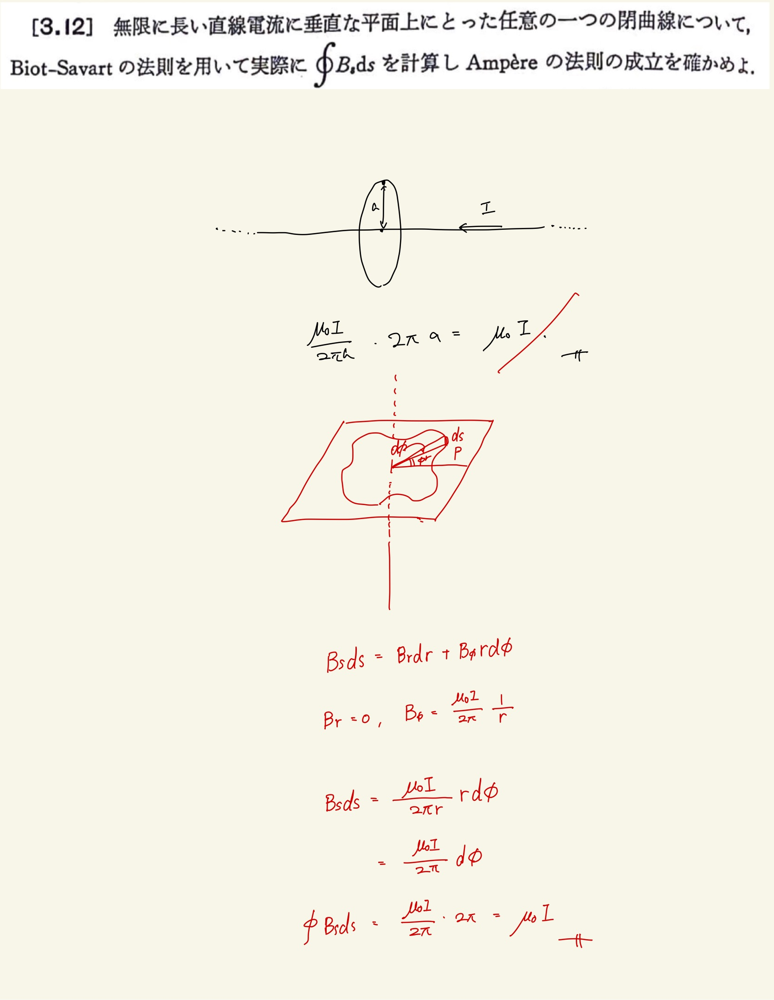

# 電流と磁場
## 3.12 Ampereの法則の導出

一般の閉曲線からAmpereの法則を導出する。
 
 
曲座標を使って$ rd \phi $で積分をしてやるとよい。
 
 
直線電流は$ r $方向の磁束密度をもたない(そんなことをしたら磁束密度の発散があることになってしまう).一周ぐるっと積分してやるといい感じに$ 2\pi $がでてくるのであとは電流と真空の透磁率だけ残る。
 
 

