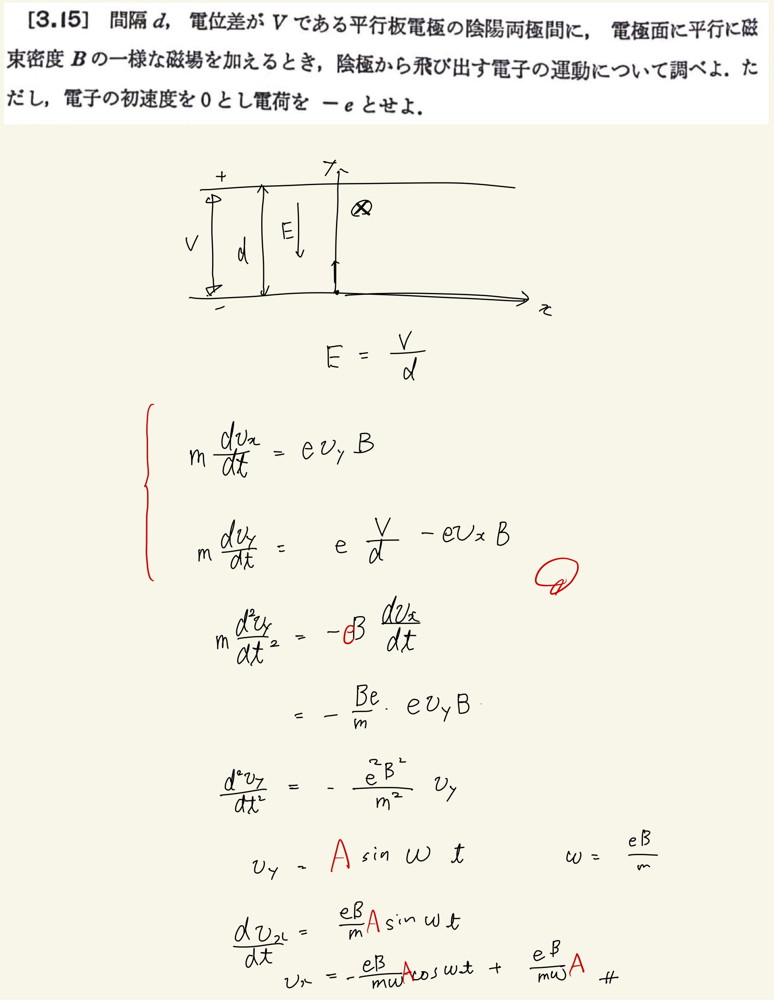
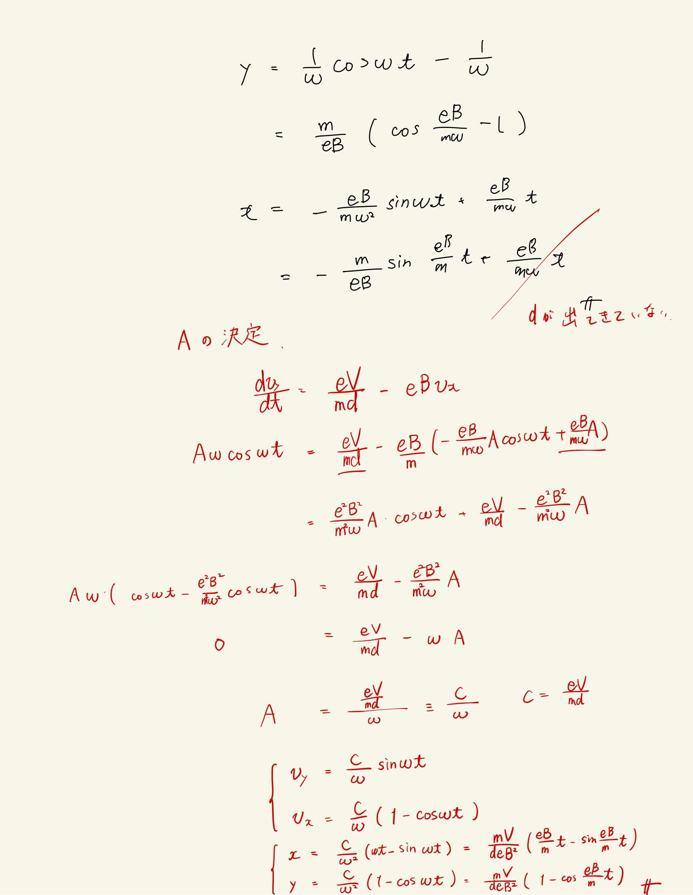

# 電流と磁場
## 3.15 コンデンサー内(磁場あり)の電子の運動

今度は静電場に加えて静磁場もあるときの電子の運動について調べる。
 
 
運動方程式はあってるんだけど、定数を決定するのがあまかったので赤字で直してます。$ y $成分のほうが情報があるのでそっちで定数を決めてやる。どちらも積分した時点で初期条件を加えた片方の方程式から積分定数は絶対に決定するのでそのときに定数は求めてしまえ？解に$ d $がでてこないわけがないのでそこで気付きましょう。\
 
 

