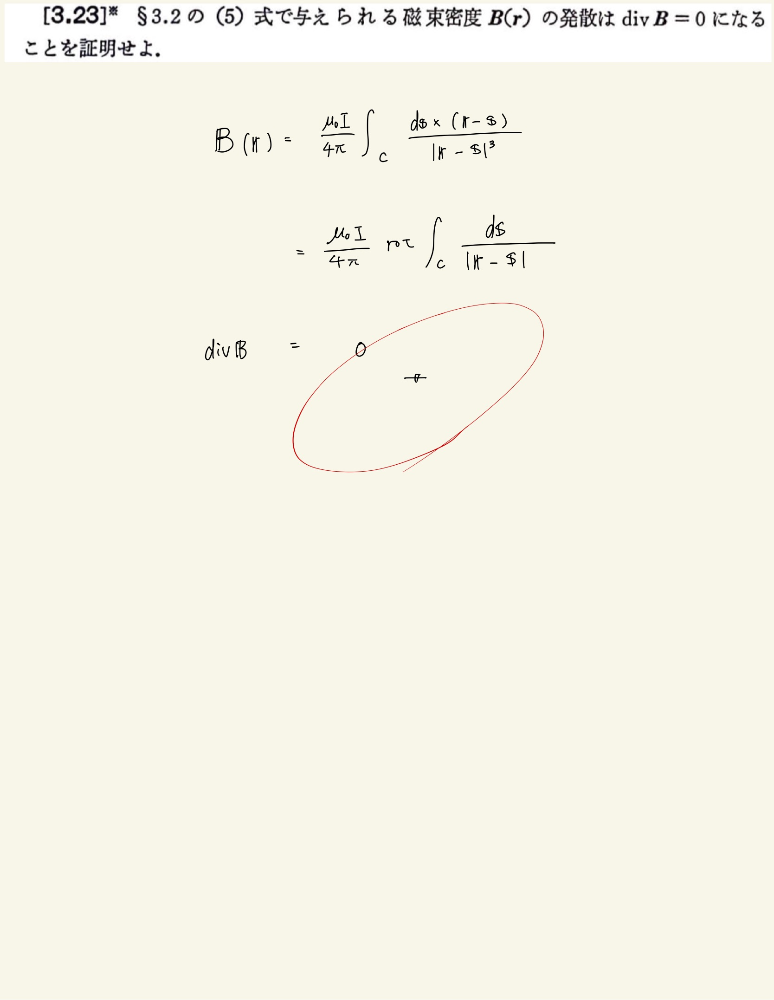

# 電流と磁場
## 3.23 磁束密度の発散

$ \mathrm{div} ( \mathbf{A} \times \mathbf{B} ) = \nabla \cdot ( \mathbf{A} \times \mathbf{B} ) = \mathbf{A} \cdot ( \mathbf{B} \times \nabla ) =  - \mathbf{A} \cdot ( \nabla \times \mathbf{B} ) = - \mathbf{A} \cdot \mathrm{rot} \mathbf{B} $
 
みたいな公式があって、覚え方は一個ずつずれるやつ。
 
 
これを使って$ \mathrm{Biot-Savart} $から導くのが正規で天才的な発想でベクトルポテンシャルを導いて発散を計算するのは丸ではないです。
 
 

