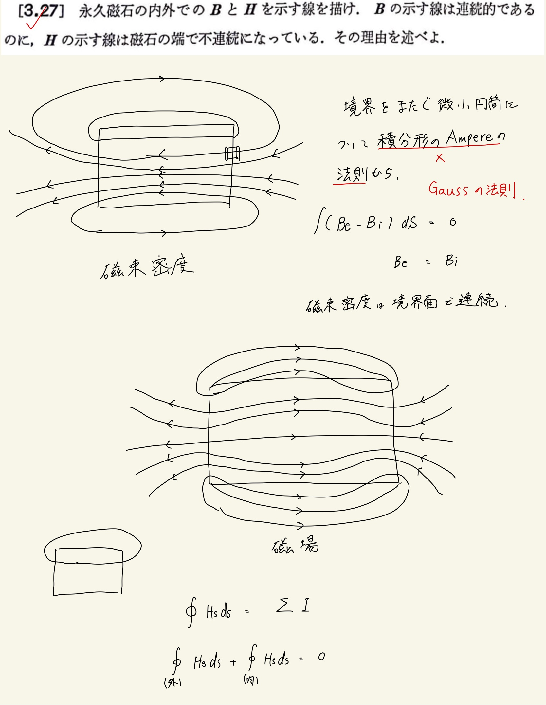

# 電流と磁場
## 3.27 磁石のつくる磁場・磁束密度

前問と同様にして、磁束密度が連続である条件から磁力線を書くとよい。
 
 
磁場は一定に連続にならないのがポイントで、それはAmpereの法則からわかる。
 
 
ある閉曲線について、外側の磁場を正とすると、内側の磁場は必ず負になる。ここから、磁場というものは内外問わずにN極からS極に向かって磁力線をつくることがわかる。
 
 
【こと問題を解くにあたってのポイント】
 
磁束密度にはGaussの法則、磁場にはAmpereの法則
 
 

