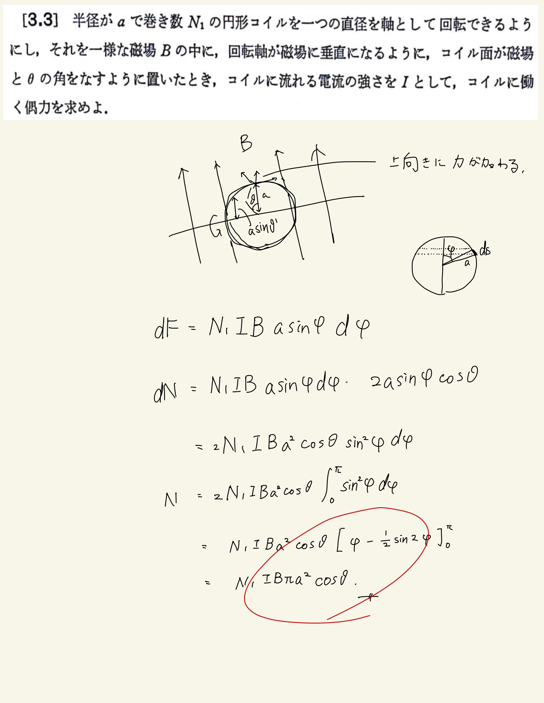

# 電流と磁場
## 3.3 円形電流にはたらくAmpereの力 

定義通りに計算してやる。
 
 
円形電流なので接線方向の電流を水平成分と垂直成分に分解することができるが、よくよく見ると水平成分(内向き)については対称性から打ち消しあってトルクには寄与しない。
 
 
$N_1$回巻いてることに注意する。働く力は普通に代数和でわかるので掛け算してやればよい。
 
 
円周で足し合わせるための$ \sin \varphi $と成分の$ \sin \varphi $と偶力のための$ \sin \theta $とで三角関数を3つ使うところが注意。円周のほうは積分のみ必要。
 
 
演習で積分すると$ \pi $しかでてこないので最終的には傾きの$ \theta $と半径しか解にはでてこない。
 
 

