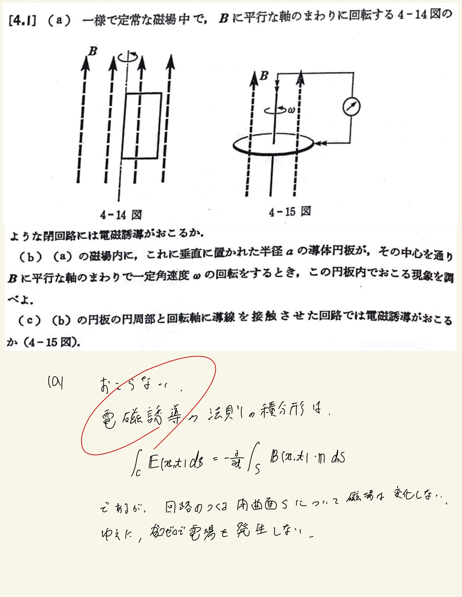
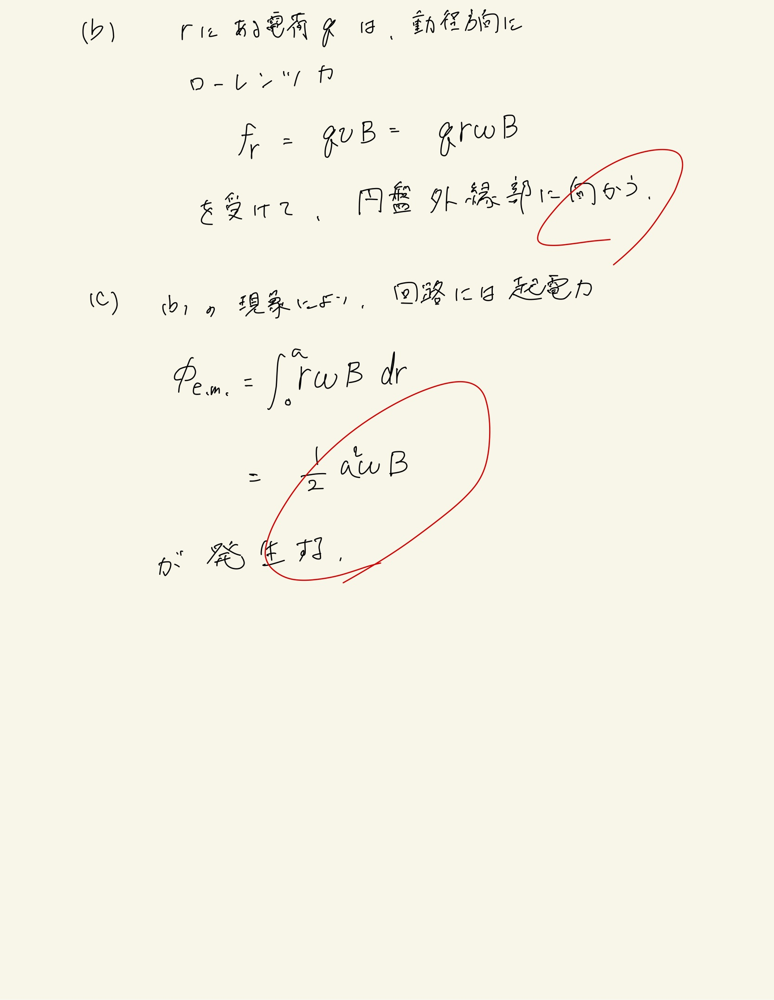

# 電磁誘導と交流
## 4.1 静磁場内で回転する回路

#### ポイント

電位の発生見分けるポイントは、
 
- 磁束が回路内を貫いているか。
- 磁束の変化が起こっているか
- ローレンツ力が作用しているか
 
 
$ \mathbf{E} = \mathbf{v} \times \mathbf{B} $ 
 
$ V = \oint \mathbf{E} d \mathbf{s} $
 
使っとけばなんとかなるなる。
 
 

