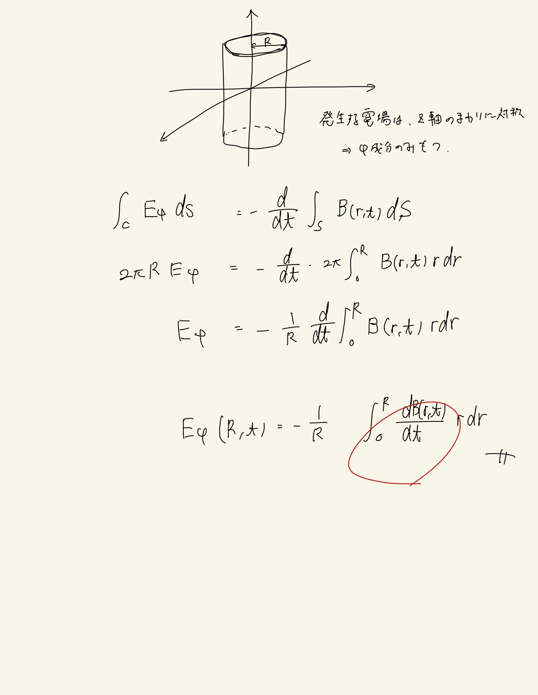

# 電磁誘導と交流
## 4.8 誘導電場

#### 方針

電磁誘導の法則(積分形)
 
$ \oint \mathbf{E} ( \mathbf{r}, t ) \mathbf{r} = - \frac{d}{dt} \int_S ( \mathbf{B} ( \mathbf{r}, t ) \cdot \mathbf{n} ) dS $
 
を使って解く。
 
 

#### ポイント

磁束密度の対称性から、$  \mathbf{E} (r, t) $となり、ガウスの法則とか使うと$E_r, E_z$はゼロになることがわかる。

 
 

