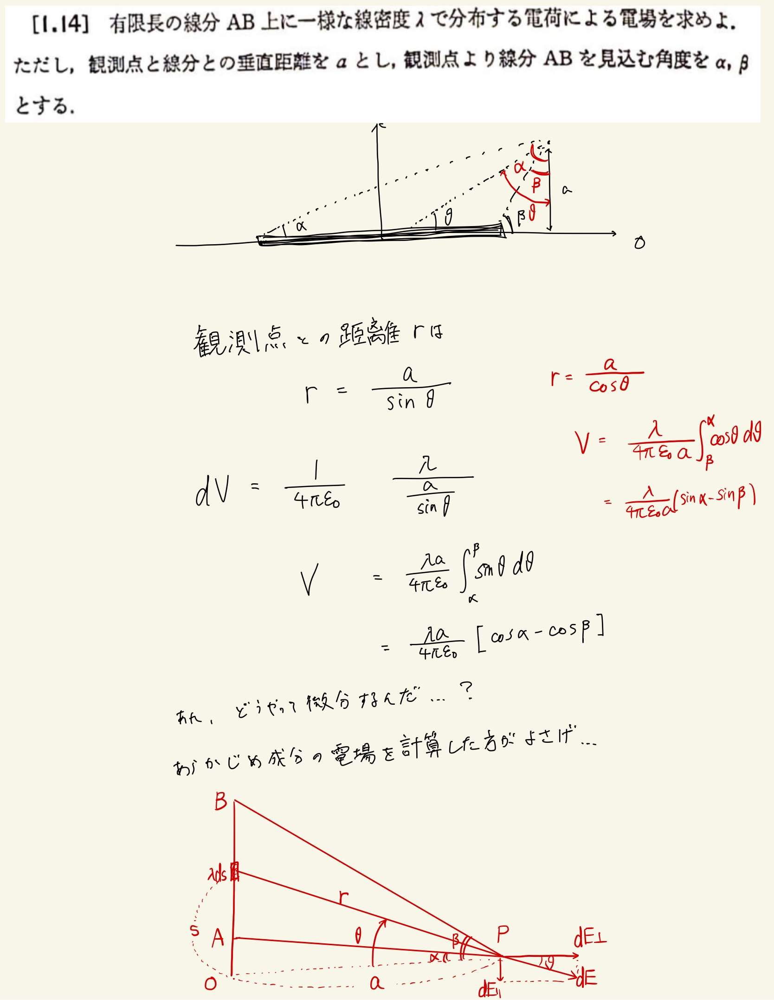
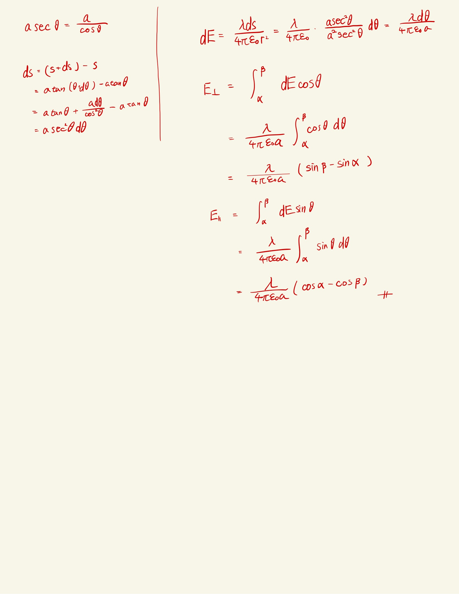

# 静電気
## 1.14 有限長の線分電荷がつくる電場

電位を先に求めたら楽だろーって思ったら$ alpha, \beta $の微分処理にめちゃくちゃ悩んだ。
 
まず角度の取り方が違う。観測点より線分を見込む角度なのだから、逆である。
 
正確な図を書いて電場の式を立式する。この際、$ ds $を表すのに苦労したので注意が必要である。($ \tan \theta$を使って求めたが他にもやり方はありそう)
 
あとは並行成分と鉛直成分に分けて計算してやれば間違いない。
 

