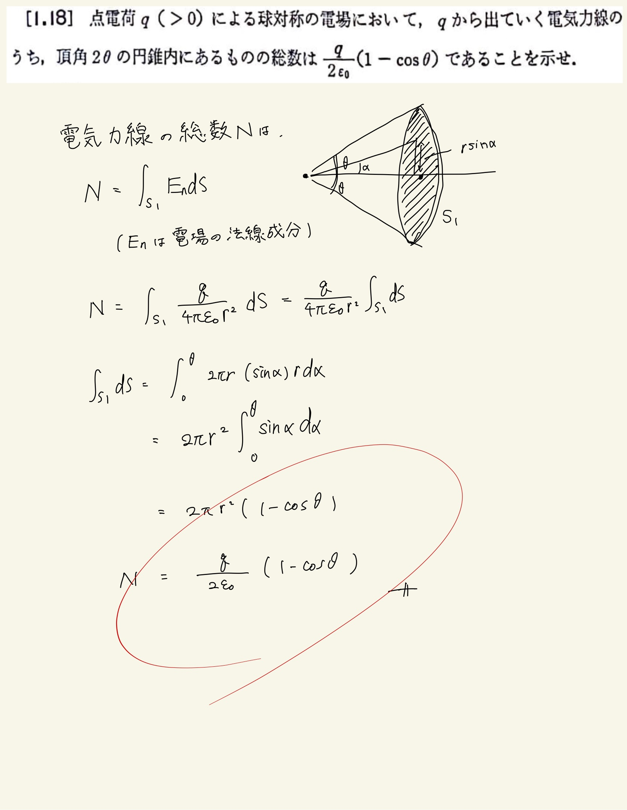

# 静電気
## 1.18 円錐を出ていく電気力線の数

(電気力線の数) = (電場を面積分したもの)
 
↑の式を覚えていないと話にならない(ならなかった)。
 
電気力線とか多分出ないと思うしそんなもの存在しないんだから覚えたくないんだけどまぁ仕方ない。
 
ここで大事なのがへんにごちゃごちゃ変形せずに$ \theta $をそのまま使うこと。面積S1の計算は円環を半径で積分してやることに相応しいのでそのようにしてやる。
 
ガウスの法則の積分形は法線成分を取ってやらないといけないので、円錐の底面積すなわち円でやってしまっては返って計算が面倒になってしまう。なので回答のようにしてoを中心とする球面の一部を考えてあげて面積分してやる必要がある。
 

