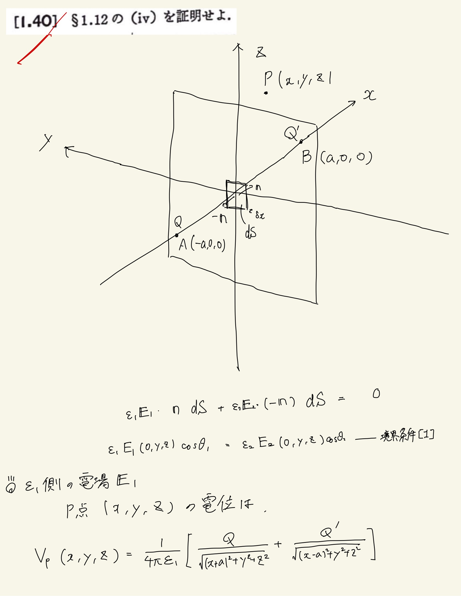
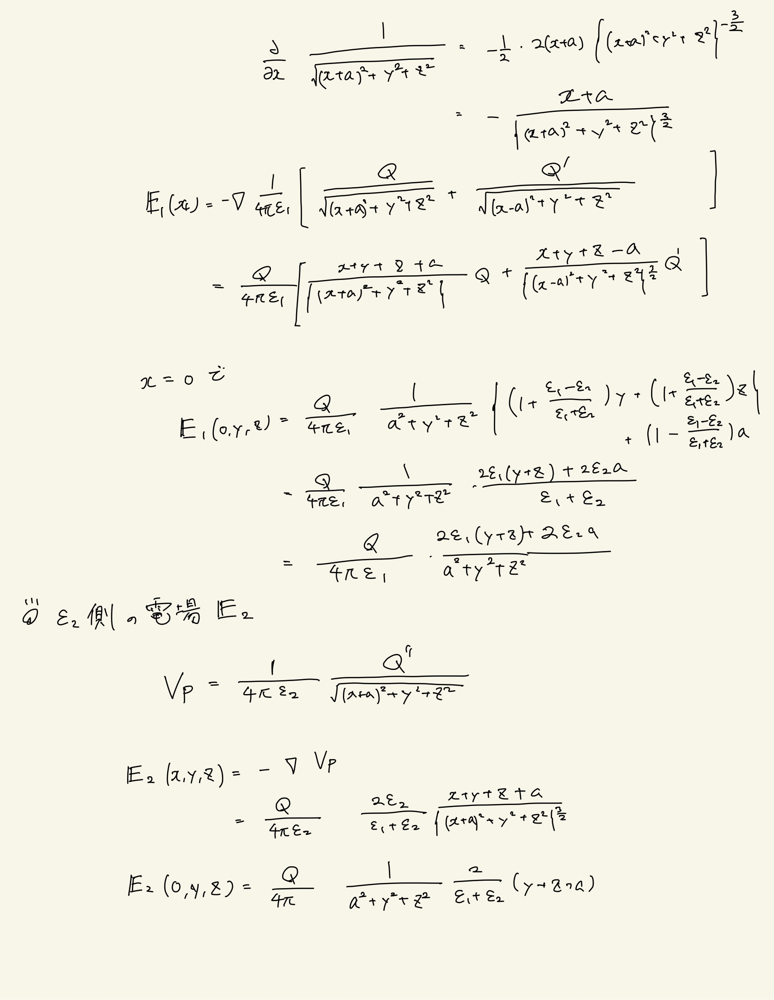
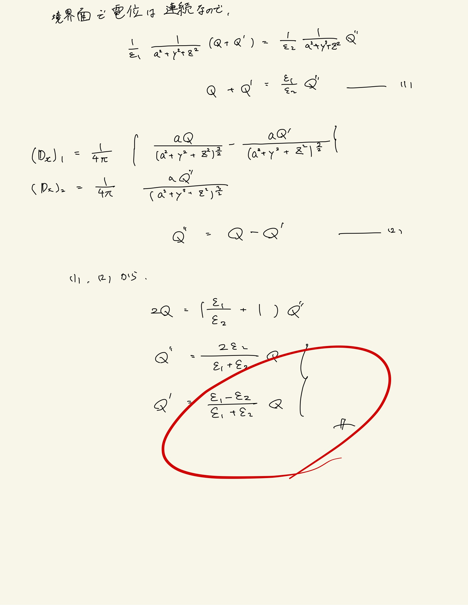

# 静電気
## 1.40 2種の誘電体間の鏡像法

§1.12　(iv)
 
誘電体境界面と点電荷：　誘電率$ \varepsilon _1 , \varepsilon _2 $の2種の誘電体が平面で接していて誘電体$ \varepsilon _1 $内の電場は次のようになる。
 
(1) 誘電体$ \epsilon _1 $内の電場はA点に電荷Qがあり、境界面に対する点$A$の対照点$B$に電荷$ Q' = \frac{ \epsilon _1 - \epsilon _2 }{ \epsilon _1 + \epsilon _2 } Q $があり、全空間が$ \epsilon _1 $で満たされたとしたときの電場に等しい。
 
(2) 誘電体$ \epsilon _2 $内の電場は$A$点に$ Q'' = \frac{2 \epsilon _2 }{ \epsilon _1 + \epsilon _2 } $の点電荷$ Q'' $があり、全空間が$ \epsilon _2$で満たされたとしたときの電場に等しい。
 

$P$点での電場を求めて、$x=0$について境界条件を解いてやると、解を見つけることができる。
 

