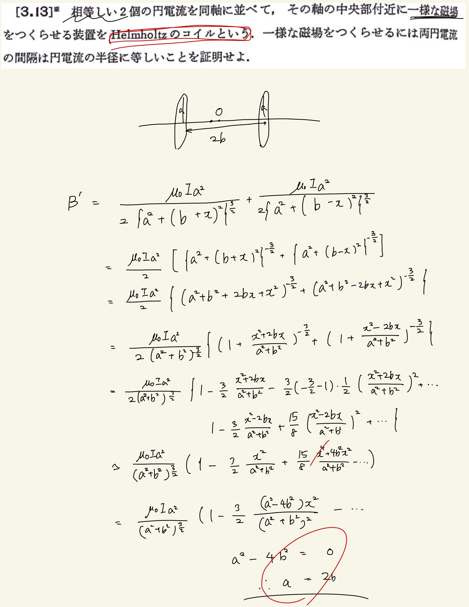

# 電流と磁場
## 3.13 Helmholtzのコイル

2個の円電流を同軸にならべて中央付近に一様な磁場をつくらせる装置を"Helmholtzのコイル"というらしい。
 
 
式はすぐに立つのだけど近似が難しい。せめて何次の近似なのかは書いてほしい(今回は2次近似)。
 
 
$ ( 1 + x ) ^ \alpha = 1 + \alpha x + \frac{ \alpha ( \alpha - 1 ) } { 2! } x ^ 2 + \frac{ \alpha ( \alpha - 1 ) ( \alpha - 2 ) }{ 3! } x ^ 3 $
 
 
↑めちゃくちゃ基本的な近似なので絶対覚えておきましょうね。
 
 

