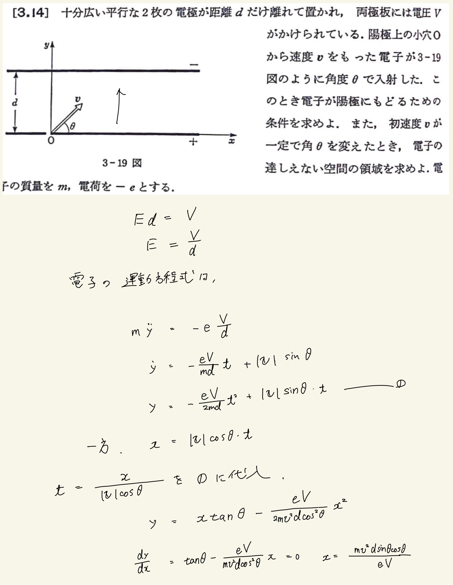
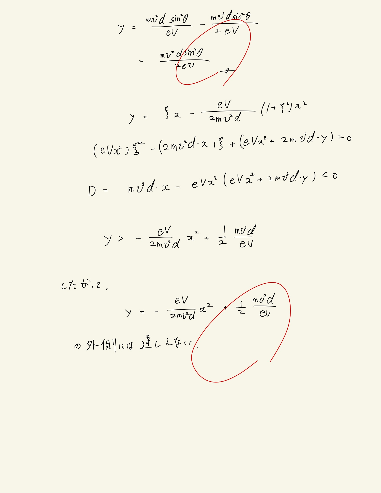

# 電流と磁場
## 3.14 コンデンサー内の電子の運動

電子が受ける力はコンデンサー内の一様な静電場のみ。斜方投射の問題と同じ。
 
 
$ x $の式が簡単なので$ t $を消去してやる。そうすると、$ \frac{dy}{dt} = 0 $となる$ x $が最大到達点となる$ x $なので元の式に代入すると最高到達点が求まる。これが$ d $より小さくなるというのが陽極に戻るための条件になる。
 
 
電子の達しえない領域、それは$ \theta $を変数としたときの二次方程式が実数解をもつことである。
 
 

