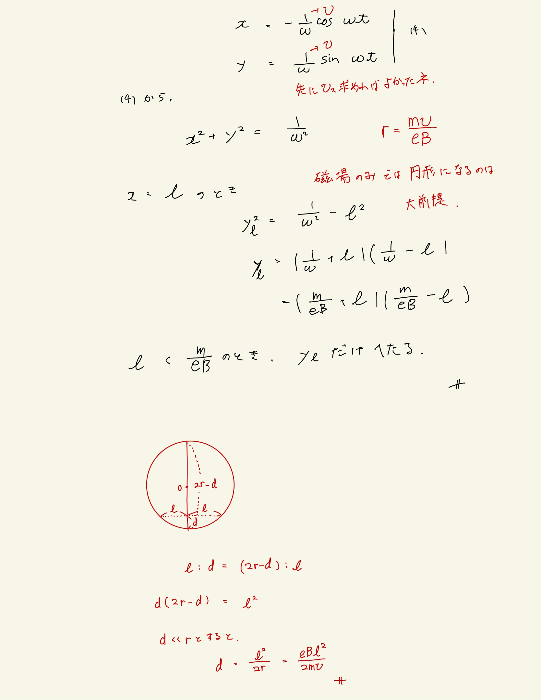

# 電流と磁場
## 3.16 磁場内の電荷の運動

磁場単体の中だと初速度を与えられた電荷は円運動をする。じゃあその半径に比べて十分に小さいlだけすすむときに軌道はどれくらいへたるかという問題。図を見るとわかりやすい。力学的なところから半径さえ求めればあとは幾何的に解ける。
 
 
自分は図が思い浮かばなかったので問題の趣旨的には何も手につかなかった。
 
 
これさらっと比が等しいことをつかってるけどすぐに出てこなくないか？
 
 
直角三角形の相似から証明は容易です。
 
 

