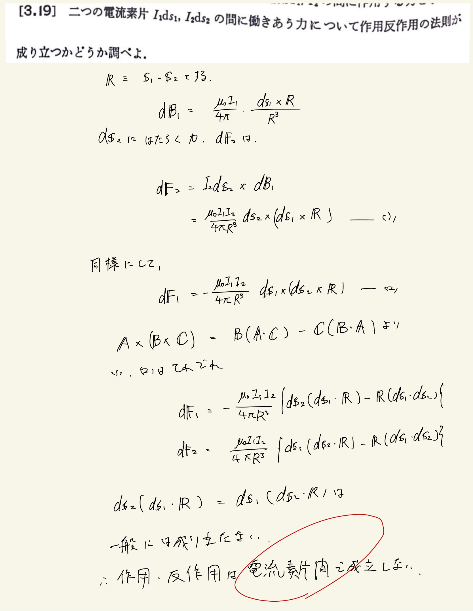

# 電流と磁場
## 3.19 電流素片間で作用する力

電流素片同士だと実は作用・反作用ほ法則は成り立たないって話。
 
 
ベクトル三重積も復讐しときますか。
 
$ \mathbf{A} \times ( \mathbf{B} \times \mathbf{C} ) = \mathbf{B} (\mathbf{A} \cdot \mathbf{C} ) - \mathbf{C} ( \mathbf{B} \cdot \mathbf{A} ) $
 
まぁ覚え方としては$ \mathbf{A},\mathbf{B} $入れ替えて内積に変えて、逆に$ \mathbf{A},\mathbf{C} $入れ替えて内積にして負を取るみたいな。
 
証明は成分ごとにやって納得した気がする。
 
 

 
 
#### 歴史的経緯
アンペールやウェーバーは電流素片間で作用する力が作用・反作用の法則を満たすようにいろいろ頑張ってたらしい。運動する帯電粒子(電流を作ってる粒子)間の遠隔作用の中心力から求めようとして粒子の質量が負になって失敗したらしい。
 
そのような過程を経て、ファラデー・マクスウェルによる近接作用による場の理論によってとってかわられていく。