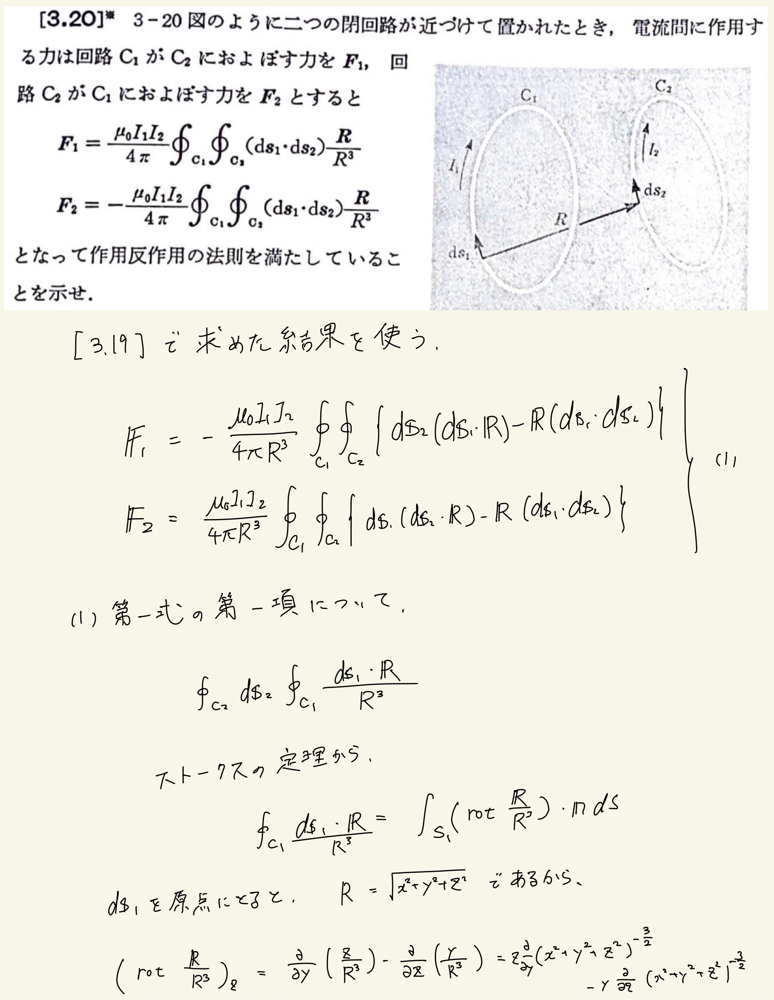
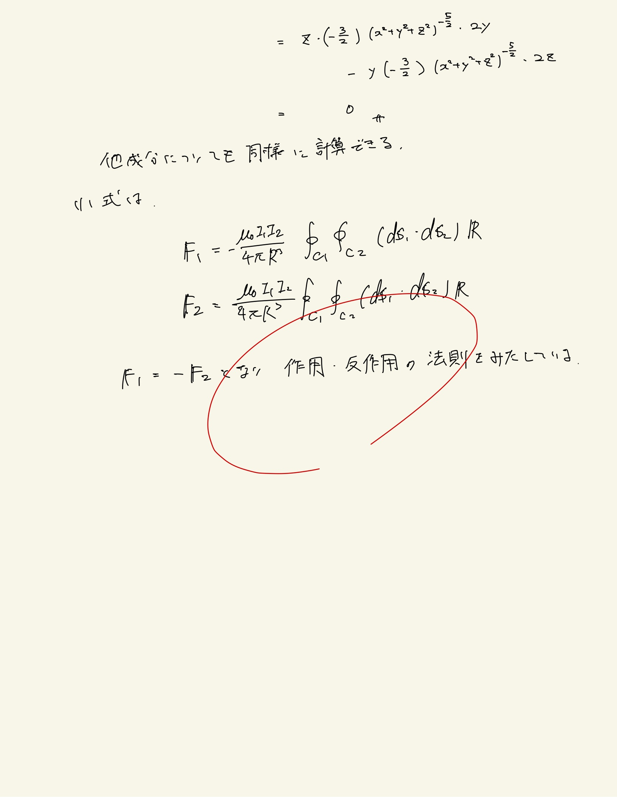

# 電流と磁場
## 微小円電流と電気双極子モーメントベクトル

$ r \gg a $で円電流が作る磁束密度は、
 
$ B_r = \frac{ \mu_0 I \cdot \pi a^2 }{ 4 \pi } \frac{ 2 \cos \theta }{ r^3 } , B_{\theta} = \frac{ \mu_0 I \cdot \pi a^2 }{ 4 \pi } \frac{ \sin \theta }{ r^3 }$
 
 

