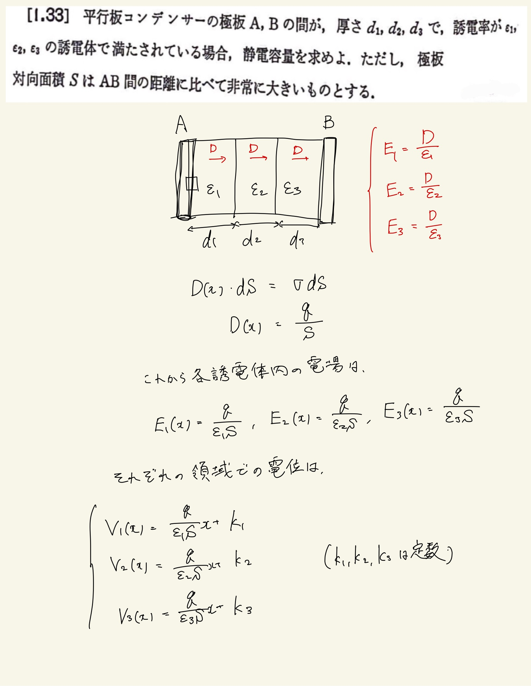
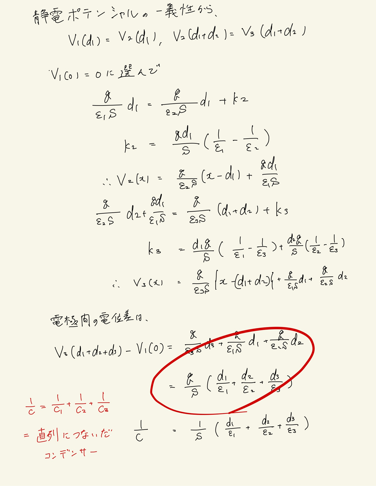

# 静電気
## 1.33 直列につないだコンデンサー

真電荷は電極表面にしかないので、ガウスの法則の積分形を電束密度について適用して全体の電束密度を求める(誘電体によらず一定)。
 
僕は面倒なことにわざわざ積分をしてしまっているが、コンデンサー内で電場が一定なのはわかっているので幅をかけてあげれば電位差は出るのでたしてやれば全体の電位差がすぐに求まる。
 
求めたいのは静電容量なので電荷を割って電荷を消去していい感じに静電容量を求める。

