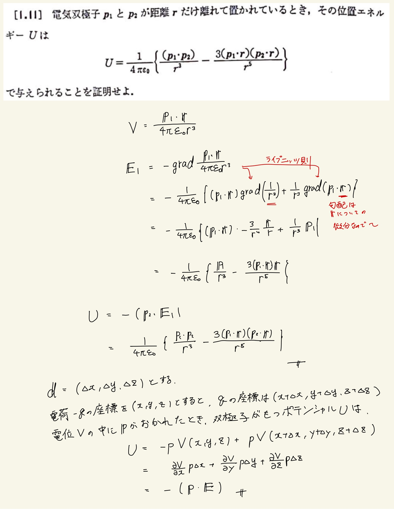

# 静電気
## 1.11 電機双極子モーメントの作るポテンシャル

 電気双極子の位置エネルギー$V$は、解答に下に照明があるように$ -( \mathbf{p} \cdot \mathbf{E} ) $となる。
  
 勾配に対してもライプニッツ則は有効である(それはそう)。それ以外の計算はそこまで難しいものではないので位置エネルギーの式を覚えているか、電気双極子の式を覚えているかが肝。
 

