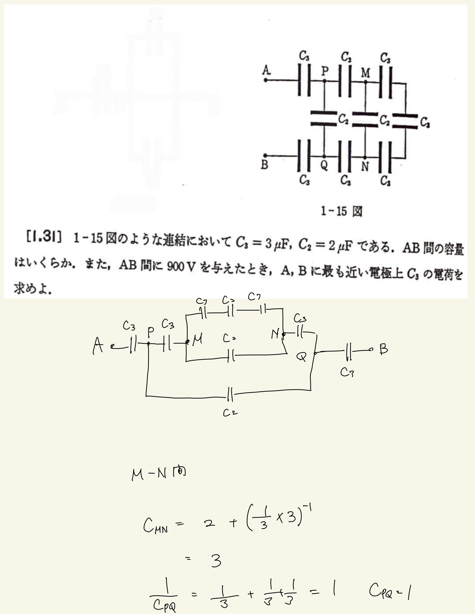
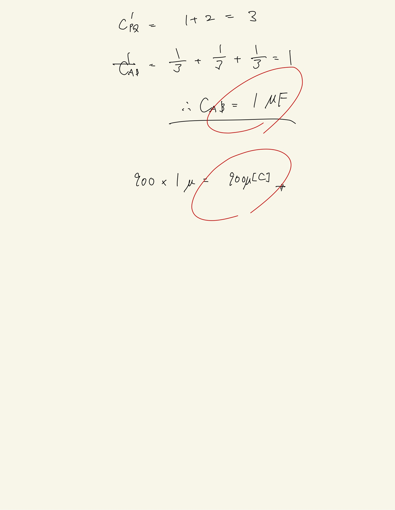

# 静電気
## 1.31 コンデンサー回路 

頭が悪いのでわかりやすい図に書き直して普通に計算した。
 
部分部分で静電容量を計算して直列/並列に応じて分数かそのままかを変えていけば問題ない。
 
直列→$ \frac{1}{C} = \frac{1}{C_1} + \frac{1} {C_2} + \frac{1}{C_3} + ... $
並列→$ C = C_1 + C_2 + C_3 + ... $

 

