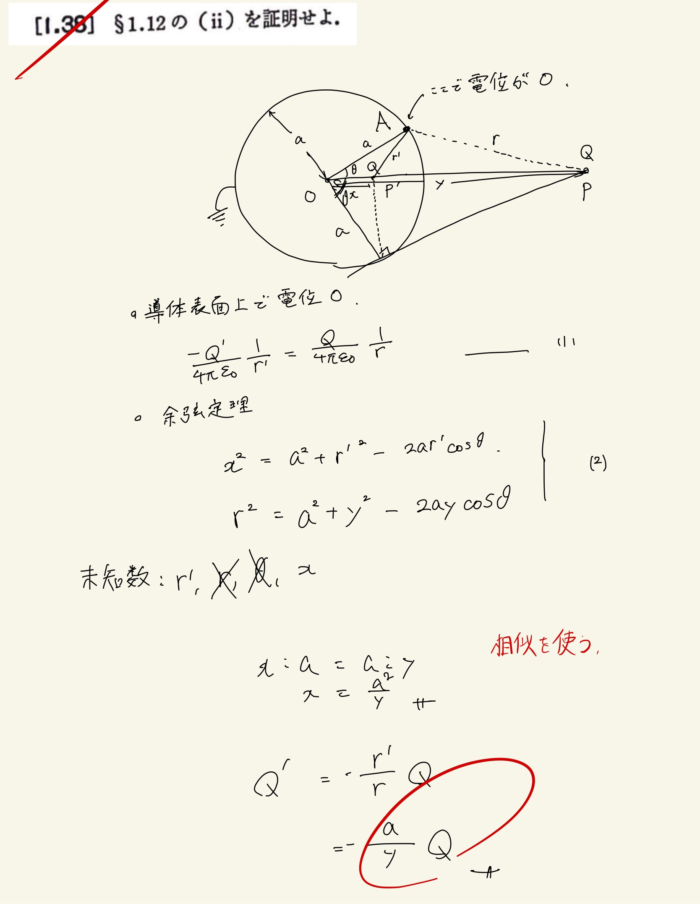

# 静電気
## 1.38 導体球の鏡像法

§1.12　(ii)
 
点電荷$Q$と半径$a$のゼロ電位の導体球とによる電場は、導体の代わりに$P'$点に$Q'$の電荷があるとして考えた場合のそれに等しい。
 

 
【お気持ち表明】
 

それぞれ$ r,r' $の距離で電位が等しくなる境界条件から、
 

$ \frac{ 1 }{ 4 \pi \varepsilon_0  } \frac{Q}{r} = \frac{ 1 }{ 4 \pi \varepsilon_0  } \frac{Q'}{r'}$

 

$ Q' = \frac{r}{r'}Q $

 

このような境界条件から、$ r,r' $の比が一定でなければならないことがわかる。

 

このとき、$ \triangle{AP'O} \sim \triangle{POA} $

 
であるから,$ a,y $の比から$ r,r' $の比も求まる。