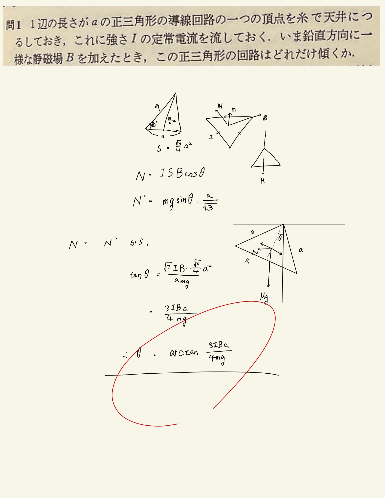

# 電流と磁場
## 3.1 正三角形コイルに作用するアンペールの力

#### ポイント

任意の閉回路について、回路の作る図形の面積を$S$、図形の平面に垂直に立てた単位法線ベクトルを$\mathbf{n}$として、
 
$ \mathbf{N} = IS \mathbf{n} \times \mathbf{B} $
 
このトルクはどこ基準でとってるんだっていうのは回路の端から端のトルクになる。トルクってか偶力ってことですね。理解。
 
 
紐があるならトルクはどこからとるんだよって思ったけど、紐との摩擦力が定義されていないので摩擦力ゼロ、すなわち紐の傾きないし存在は考えなくていいっぽい。なので天井から直接つるしたみたいな図を書きました。
 
 
閉電流のつくる図形の面積に、その平面に垂直に立てた単位ベクトル$ \mathbf{n} $と磁束密度$ \mathbf{B} $の外積をかけたやつが回路に作用するトルクになるので、トルクは回路平面上にあります。また、その大きさは傾きによって変わる。ので傾くほどトルクの水平成分は小さくなります。
 
それに対して傾くほど水平成分の大きくなる重力によるトルクとの釣り合いを調べるのが問題を解く方針。
 
 
正三角形の重心は頂点から$ \frac{a}{ \sqrt{3} } $のところにあり、その面積は$ \frac{ \sqrt{3} }{4} a $になります。覚えておくと便利そう。
 
 
