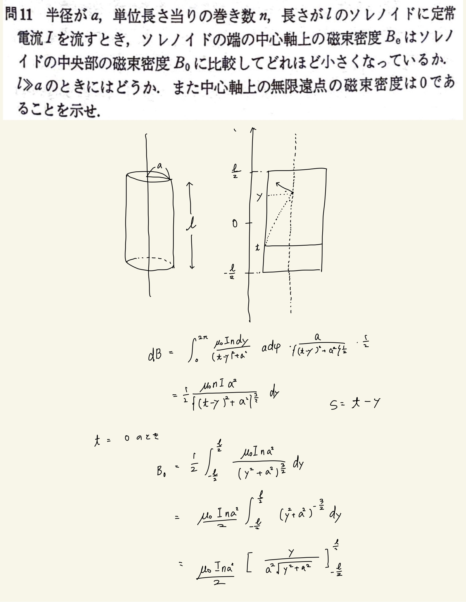
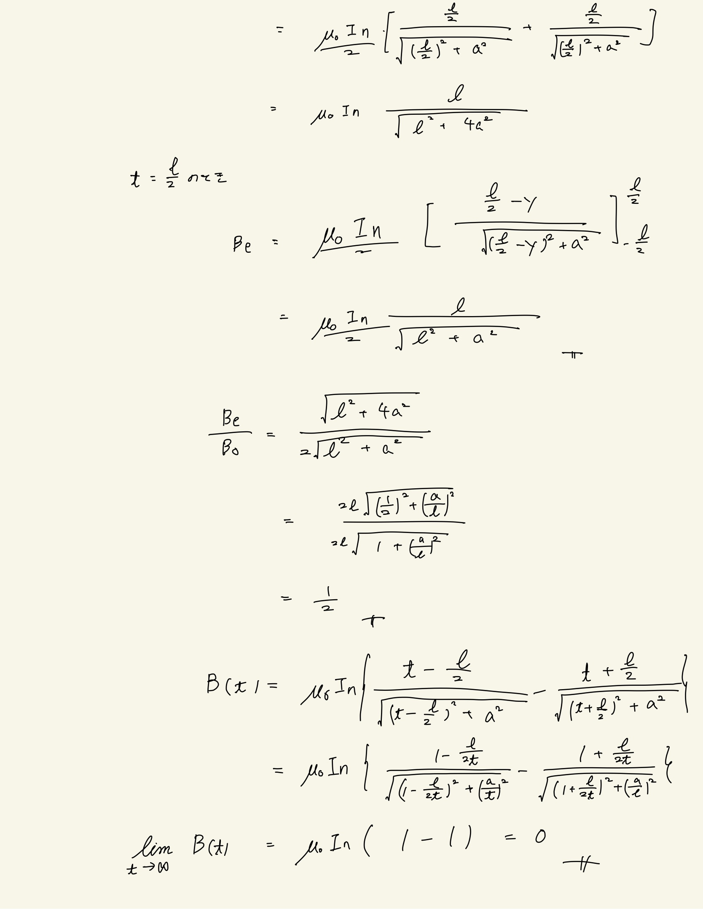

# 電流と磁場
## 3.11 有限長ソレノイドが中心軸上につくる磁場

#### 方針

円電流のつくる磁束密度の式を適切に座標をとって積分してやる。
 
 

#### ポイント

磁束密度のできる方向が最初間違えてたので気を付ける。外積なのでね。
 
まぁ本当に座標を正しくとってやることが一番大事。
 
三角関数で解いた方がいろいろ楽だったかもしれない。

 

$ \int \frac{1}{ (c + x^2)^{\frac{3}{2}} } = \frac{x}{c(c+x^2)^{\frac{1}{2}}} + C $
 
↑これはめちゃくちゃ使える。

 
 

#### 導出

