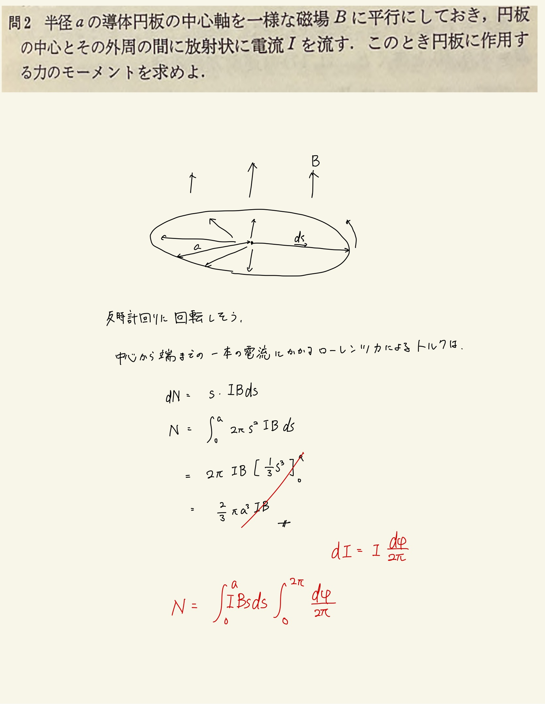

# 電流と磁場
## 3.2 円盤型放射電流に作用するアンぺールの力

#### 方針

まぁ見た感じ半時計周りに回転しそう。角度$ d\varphi $におけるアンペールの力によるトルク計算してあと円周で積分したら出るやろ。

 
 

電流は全電流が$I$で定義されてたみたいですね。答えに$2\pi$が出てこなかったのはそのためっぽい。あと僕なんか電流の幅的な概念が必要だと思ってを$sd\varphi$で導入してたけど、それだとうまく計算できなくないかと思った。全電流$I$を$2\pi$で分け分けするって考えないとうまくいかなさそう。
 
 

