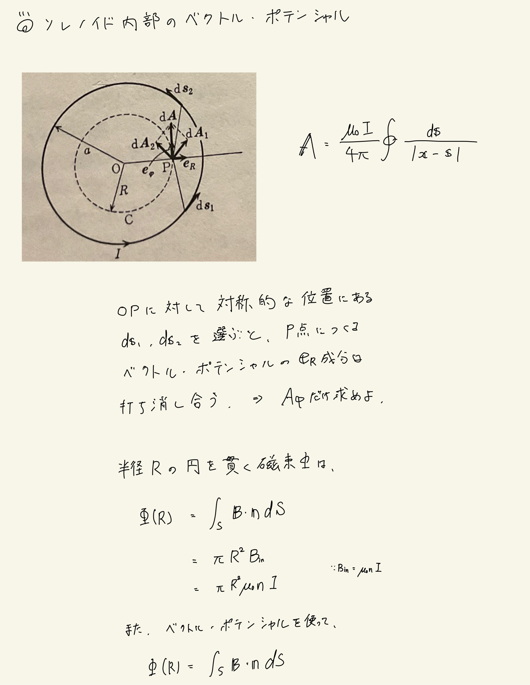
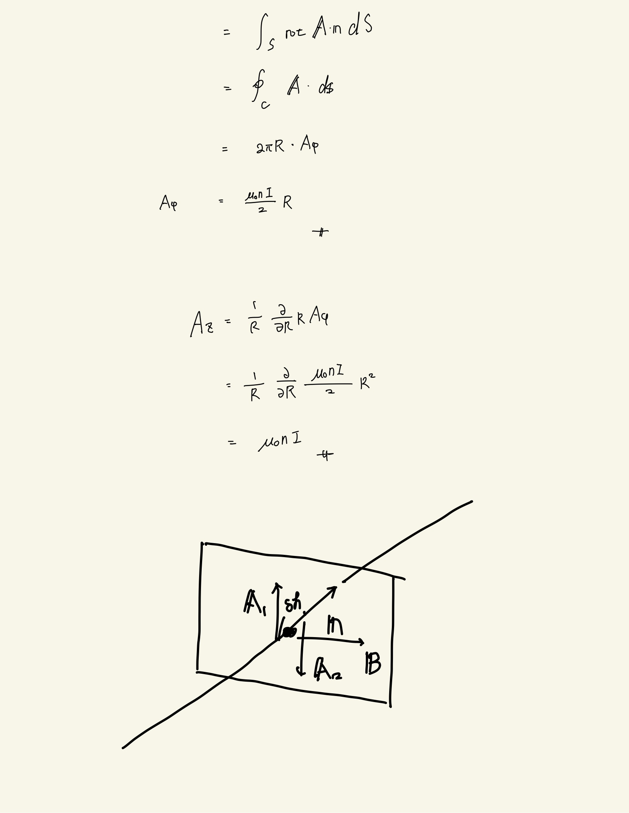

# 電流と磁場
## 例題5 ソレノイドのつくる静磁場

#### 結論

対称性から、無限に長いソレノイドのつくるベクトル・ポテンシャルは円筒座標系について$\varphi$成分しか持たない。
 
ソレノイド内部： $ A_\varphi = \frac{\mu_0 n I }{2} R $
 
ソレノイド外部： $ A_\varphi = \frac{\mu_0 n I }{2} \frac{1}{R}  $
 
 

#### 方針
とにかく対称性が大事なので、$\varphi$成分以外持たないことを確かめる。
 
また、磁束を考えて、既に分かっている磁束密度からベクトル・ポテンシャルを導出する。
 
 

#### 導出

